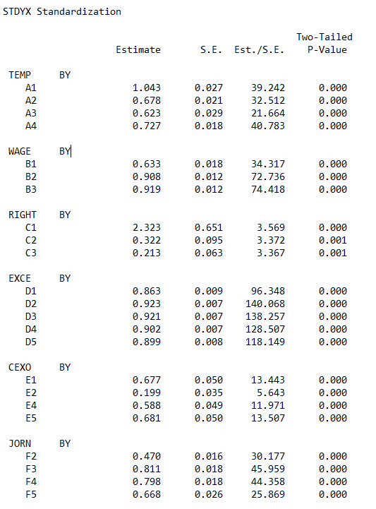

```{r setup, include=FALSE}
knitr::opts_chunk$set(echo = TRUE)
```

Texto elaborado en el marco del Trabajo N°3 del [Diplomado de Postítulo Análisis Multivariable](http://www.facso.uchile.cl/postgrado/123608/diplomado-de-postitulo-analisis-multivariable) de la Universidad de Chile. Actualmente está en desarrollo y mejora para publicarse como capítulo de libro. [Repositorio github aquí](https://github.com/nicolasrattor/Escala_precariedad_informales). 

Aunque este es un trabajo original, ha sido realizado en base a muchas de las reflexiones y análisis desarrollados en el marco de los objetivos 1 y 2 del proyecto FONDECYT 1171105 (2017-2019) *"Contextual determinants of employment conditions and health in Chile. A multilevel study combining regional and individual level data on labor market performance, employment precariousness, and workers' health and wellbeing"* liderado por la profesora [Alejandra Vives](https://medicina.uc.cl/persona/dra-alejandra-vives-vergara/) del Departamento de Salud Pública de la Universidad Católica.
 
# Antecedentes y planteamiento del problema de investigación  	
A pesar de estar clasificado dentro de los países de altos ingresos por el Banco Mundial y ser parte desde hace una década de la OCDE, Chile presenta un mercado laboral con características de economías aún en desarrollo o de ingresos medios, con altos niveles de informalidad y creciente subempleo (OCDE, 2015; OIT, 2017). A modo más general, el mercado laboral chileno ha sido caracterizado por su extendida precariedad, incluyendo la falta de cobertura de protección social, bajos ingresos y la ausencia de contratos indefinidos, que en conjunto tienen un efecto nocivo para la salud de los trabajadores (Ministerio de Salud, 2011; Vives et al, 2017). Además de la precariedad laboral, destaca el caso chileno por la alta proporción de trabajadores independientes (trabajadores por cuenta propia y pequeños empleadores), que durante los últimos años ha llegado a uno de cada cuatro ocupados, según estadísticas de la Encuesta Nacional de Empleo, proporción que casi triplica a la observada en las economías de ingresos altos (OIT, 2020).

Precisamente estas dos últimas características del mercado laboral -precariedad y trabajo independiente o por cuenta propia- han sido escasamente estudiadas en conjunto, destacando a nivel internacional el trabajo de Leah Vosko (2010) y los estudios de Eurofound sobre trabajo por cuenta propia y relaciones industriales (Pedersini, 2009) y sobre trabajadores autónomos económicamente dependientes (Oostveen et al, 2013). En Chile, si bien existe una extensa literatura sobre precariedad y diversos estudios sobre el trabajo por cuenta propia, especialmente desde la economía, ambos fenómenos han sido tratados de manera conjunta en escasas ocasiones (Jiménez, 2013; Gálvez, 2001, 2003). En estos estudios se ha observado que la precariedad es un problema relevante en el mundo de los trabajadores independientes, pero que tiene especificidades que obligan a conceptualizar y medir el fenómeno de una forma diferente a lo que tradicionalmente se considera para el análisis de los asalariados. 

Sin embargo, lo que suele estudiarse cuando se analiza la precariedad laboral, es la realidad de los asalariados y en particular el debilitamiento de la relación salarial (Ruiz-Tagle y Sehnbruch, 2015), porque precisamente los marcos conceptuales que se han importado provienen de realidades donde la asalarización se encuentra mucho más extendida que en América Latina (Castel, 2010). Salvo excepciones notables (Julián y Blanco, 2019), este enfoque ha sido asumido acríticamente, lo que ha tenido como consecuencia la ya mencionada ausencia de estudios sobre la precariedad laboral de otras categorías ocupacionales distintas al asalariado. Sin embargo, cualquier análisis sobre la realidad de los trabajadores en Chile o las características del mercado laboral chileno no debería desconocer la situación de los trabajadores independientes.

El presente trabajo, presenta una propuesta para la medición de la precariedad laboral en los trabajadores independientes que considere la especificidad de esta categoría ocupacional, a partir de la adaptación de la Escala de Precariedad del Salariado aplicada en su versión chilena (EPRES-Ch) en la Encuesta Nacional de Condiciones de Empleo, Trabajo y Salud (ENETS) de los años 2009-2010, utilizando para la evaluación del test propuesto la técnica de análisis factorial confirmatorio de ítems o AFI (Wirth & Edwards, 2007). Complementando esta Introducción, se presentan los antecedentes conceptuales sobre el trabajo independiente, la precariedad laboral y una propuesta para su medición, basada en la ERES-Ch. 

## Los trabajadores independientes
Bajo la etiqueta de trabajadores independientes conviven grupos diversos -en relación a las causas de la situación de independencia y las consecuentes formas de empleo- que ocupan posiciones de clase “contradictorias” (Wright, 1994), en tanto el mismo agente informal es a la vez propietario de los medios de producción y de trabajo y trabajador directo (Poulantzas, 1973: 109). Es decir, habría en los trabajadores independientes un componente de clase dual: obreros y capitalistas; asalariados y empresarios, sin ser completamente ni uno ni otro en la medida que no entran en ninguna relación salarial, y no venden (ni compran, la mayoría de las veces) fuerza de trabajo, sino directamente los bienes y servicios que producen. Estos elementos son fundamentales para comprender los orígenes mixtos de la precariedad laboral en este grupo, como se verá más adelante. 

Operacionalmente, según la Clasificación Internacional de la Situación en el Empleo del año 1993 (CISE-93) los trabajadores por cuenta propia son aquellas personas que trabajan en sus propios negocios o empresas con el propósito de obtener una ganancia a partir de la venta de productos o servicios en el mercado, que no tienen un empleador ni emplean a otras personas de forma permanente, aunque pueden tenerlos en forma esporádica o temporal y pueden contar con la ayuda de trabajadores familiares auxiliares. En cuanto independientes, son también quienes “toman las decisiones operacionales que afectan a la empresa, o delegan tales decisiones, pero mantienen la responsabilidad por el bienestar de la empresa” (OIT, 1993) y cargan con el riesgo económico del negocio. 

Por otra parte, a partir de la revisión de literatura sobre el trabajo independiente o por cuenta propia, es posible identificar dentro de esta categoría tres tipologías de trabajadores bien diferenciados: por un lado, se encuentra una forma “schumpeteriana” típicamente europea, que coincide con un desarrollo auténtico de iniciativas de independencia y emprendimiento (entrepreneurship) y donde se pone en valor la autonomía y la realización personal con el trabajo (“doing what you like”; Benz y Frey, 2008). En segundo lugar, destaca una forma “adaptativa” o de subsistencia, propia de economías emergentes y de los segmentos de menor escolaridad (o productividad, si se quiere), donde el trabajador se encuentra en una situación de vulnerabilidad a la espera por un empleo dependiente protegido, y el trabajo por cuenta propia surge como alternativa al desempleo, asociándose por lo general a una condición de informalidad (Cea et al, 2009; Perry et al., 2007). Desde hace una década, aproximadamente, una tercera tipología se vuelve más nítida, que podría identificarse como la forma “neoliberal”, por cuanto responde a la desregulación de los marcos laborales y la expansión de la economía colaborativa y el trabajo de plataformas, correspondiendo a la situación de los falsos independientes o bogus (Boheim y Muehlberger, 2006), dependientes periféricos (Gálvez, 2003), contratistas dependientes (OIT, 2018), y con la aparición de las plataformas, gig workers. 

## Precariedad laboral
La precariedad laboral ha sido definida como la fragilización de la relación salarial a partir de la flexibilidad laboral que refleja (o intensifica) una asimetría en las relaciones de poder que definen el marco de las relaciones laborales (Cano, 1998, 2004; Amable, 2009). Representa una situación de vulnerabilidad de la continuidad y control del empleo y la profesión que reduce la capacidad y autonomía de los trabajadores (Cano, 1998). El trabajo precario le impide al sujeto trabajador vivir satisfaciendo todas sus necesidades materiales, trabajar sin riesgos psicosociales o de sufrir accidentes, a la vez que le imposibilita tener certezas y protección social en caso de enfermedad y/o jubilación (Julián y Blanco, 2019). Las formas precarias del trabajo implican una degradación de las condiciones de trabajo durante la vida laboral que se experimenta como un “sentimiento de pérdida” (Guadarrama, Hualde, & López, 2012), una constante amenaza de despido, y una inserción intermitente en el mercado de trabajo. 
En cuanto dimensión psicosocial, la precariedad se sitúa en el espacio intersubjetivo de la vida cotidiana en el trabajo y en las relaciones sociales que en ese espacio se generan (Amable, 2006), y entre otras cosas, “bloquea” los efectos positivos, manifiestos y latentes, del empleo y genera efectos dañinos sobre la salud (Benach et al, 2014). Precisamente con relación a la salud y la calidad de vida de los trabajadores es que el estudio de la precariedad ha mostrado sus progresos más importantes, demostrándose con claridad hasta qué punto la situación de precariedad resulta nociva para la salud física y mental de la población, encontrándose evidencia contundente al respecto en desenlaces tan variados como depresión, enfermedades cardiovasculares, dolores musculoesqueléticos, entre otros (Benach et al, 2014; Vives et al, 2019). 
En base a estas ideas y evidencia, Amable y otros desarrollaron en España un instrumento para medir multidimensionalmente la precariedad, al que le denominaron Escala de Precariedad del Salariado (EPRES), para la investigación en salud. La escala mide en trabajadores asalariados seis dimensiones de la precariedad: temporalidad del contrato, que incluye duración de contrato, tiempo en el empleo actual y desempleo en el año anterior; suficiencia de los ingresos y deprivación económica; cobertura en derechos y protección social; capacidad para ejercer derechos relacionados con el uso del tiempo; desempoderamiento o individualización de la negociación de las condiciones de trabajo; y vulnerabilidad o indefensión al trato abusivo en el espacio laboral (Vives, 2017, p. 2). Más allá de su enfoque en el estudio de la relación entre precariedad y salud, la perspectiva multidimensional de la EPRES^[La EPRES ha sido validada en Cataluña, en España y en Centroamérica en encuestas de gran tamaño, así como en otras regiones en estudios más acotados. Con algunas adaptaciones a la realidad chilena y modificaciones de su original en base a la experiencia española (Vives, 2017), la EPRES fue incluida en la ENETS 2009-2010 con sus 6 dimensiones y 22 ítems.] la transforma en un instrumento potente para el análisis y monitoreo de la situación de los trabajadores, a nivel individual, y de las características del mercado de trabajo, a nivel general. Sin embargo, la utilidad y generalidad de la EPRES se relativiza al considerar la precariedad laboral como un fenómeno transclasista (Julián y Blanco, 2019), que se expresa de forma específica -y eventualmente con mayor intensidad- en los empleos no asalariados. Como se presentará a continuación, la precariedad en los trabajadores independientes tendría particularidades que obligan a modificar los instrumentos que buscan registrarla.

## Una propuesta para la medición de la precariedad en los trabajadores independientes
Como ya se ha señalado, analíticamente los trabajadores independientes serían al mismo tiempo asalariados y empleadores (de sí mismos) (Wright, 1994). Compartirían con los asalariados, entonces, las fuentes de la precariedad capturadas en las cuatro dimensiones comunes de la EPRES, que son las que no suponen una relación salarial: temporalidad, ingresos, derechos y ejercicio de derechos. Pero, por otra parte, los trabajadores por cuenta propia se ven expuestos en su calidad de capitalistas a otras fuentes de la precariedad que, grosso modo, pueden distinguirse en dos grupos: la eventual falta de independencia para controlar el proceso productivo y la carencia de protección frente a los riesgos que naturalmente los capitalistas asumen.
Gálvez (2001) propone el concepto de “dependiente periférico” para identificar a los trabajadores que son jurídicamente independientes (esto es, de forma residual, no contratados como asalariados), pero en los hechos están sometidos a relaciones de dependencia más o menos evidentes respecto a otra entidad: o bien no concurren libremente al mercado de bienes/servicios que producen, sino que lo hacen a través de un tercero que más o menos exclusivamente compra toda la producción y/o que puede normar las formas de producción (jornada, precios, procesos, etc.). El carácter de precariedad estaría por lo observado en estudios cualitativos respecto a que estos trabajadores reconocen en la independencia y autonomía la cara positiva del trabajo por cuenta propia, y en el control externo, lo opuesto (Jiménez, 2013), asociando la falta de independencia a insatisfacción con el trabajo (Boheim y Muehlberger, 2006). 

Otra dimensión del control es endógena, y es precaria la situación cuando el propio proceso productivo o la necesidad de presencia constante en el mercado de bienes y servicios impide una reproducción saludable de los ritmos biológicos y sociales del trabajador, obligándolo a ritmos e intensidades de trabajo indeseables, insalubres o incompatibles con la vida familiar (Artazcoz et al, 2007; McNamara et al, 2011). Esta falta de control sobre el proceso productivo se evidenciaría en que los trabajadores independientes no pueden controlar la extensión de la jornada de trabajo, lo que otros autores han denominado como “cronopiedad”, la que se expresaría en una alta cantidad de horas de trabajo realizadas semanalmente (Julián y Blanco, 2019). 
El riesgo económico, por su parte, es un elemento constitutivo de la independencia, tal como se señala en la definición estadística de la CISE-93. Administrar el riesgo implica tomar todas las acciones necesarias para salvaguardar los bienes de la empresa ante posibles pérdidas derivadas de la actividad (Verbano y Venturini, 2013), y en este sentido, no es el riesgo lo que definiría la situación de precariedad, sino la falta de protección frente al mismo. También en este caso hay dos dimensiones: la ausencia de protección frente al riesgo de carácter dinámico, referido a la posibilidad de obtener pérdidas (o ganancias) económicas como consecuencia de la incertidumbre asociada a la adopción de ciertas acciones, y la ausencia de protección frente al riesgo de carácter estático, referido al riesgo indeterminado, sin posibilidad de obtener ganancia, asociado a los accidentes que afectan los recursos de la empresa. Ambas fuentes de riesgo constante suponen que el trabajador debería adoptar medidas de protección.

De este modo, se propone las siguientes definiciones de las dimensiones específicas de la precariedad para los trabajadores independientes, derivadas de su situación de empresarios:

+ El control exógeno de las condiciones de trabajo, derivado de la inconsistencia entre la independencia jurídica y la heteronorma de hecho producto de un alto grado de encadenamiento hacia adelante (clientes) y hacia atrás (proveedores) en la que podría encontrarse el trabajador. En el extremo, la independencia puede ser sólo jurídica cuando el trabajador tiene una relación de exclusividad y su actividad se encuentra normada tanto como la de un trabajador asalariado dependiente de la empresa cliente.

+ El control endógeno de las condiciones de trabajo, manifestado en la extensión de la jornada y el dominio que el proceso de trabajo ejerce sobre las condiciones del trabajador independiente. Como ideal, se esperaría que el ritmo de trabajo sea similar al que socialmente se ha establecido como norma para los asalariados, o menos, en la medida que sea económicamente sostenible.

+ La ausencia de protección frente al riesgo de carácter dinámico traería como consecuencia la vulnerabilidad de los ingresos del hogar-empresa derivada del flujo variable de ingresos y la unión de los ingresos de la empresa y del hogar.

+ La ausencia de protección frente al riesgo de carácter estático, medido concretamente a través de la protección frente a accidentes que afecten al capital invertido por la empresa (instalaciones, maquinaria, herramientas, insumos, etc.).

De estas dimensiones se derivan conceptos y propuestas de indicadores posibles de construir con las variables de la ENETS. Sin embargo, por el objetivo de esta encuesta, no se cuenta con indicadores para evaluar las dimensiones asociadas a la protección frente al riesgo económico dinámico y estático (por ejemplo, variables como la formalización tributaria, separación de los ingresos de la empresa y del hogar, o la existencia de seguros frente a accidentes). En cambio, sí se encuentran preguntas que se acercarían a la medición del grado de encadenamiento y normatividad del trabajo como indicador del control exógeno, y también preguntas sobre la extensión de la jornada de trabajo que darían cuenta del control endógeno. Cabe recordar, por último, que la propuesta incluye, además de estas dos dimensiones, las cuatro presentes en la EPRES y comunes a los asalariados. Las preguntas propuestas para medir cada dimensión se presentan en la sección siguiente.

# Método          	
La Encuesta Nacional de Condiciones de Empleo, Trabajo y Salud fue realizada por el Ministerio de Salud de Chile, y corresponde a una encuesta transversal representativa, a nivel nacional, urbano/rural y de cada una de las 15 regiones existentes al año 2009, de la población de 15 años y más que tuvo algún trabajo remunerado durante los 12 meses anteriores al empadronamiento. El marco muestral se desprende del Censo de Población y Vivienda del 2002 con actualizaciones derivadas de la información sobre nuevas construcciones y del empadronamiento. El diseño de muestreo es “probabilístico, múltietapico, estratificado geográficamente y por tamaño poblacional en el área urbana y rural” (Solar et al, 2010, p. 35), correspondiendo las unidades de muestreo a las municipalidades, manzanas censales, viviendas y como unidad final el informante dentro de la vivienda. El trabajo de campo se realizó entre los meses de septiembre de 2009 y octubre de 2010, obteniendo una tasa de respuesta del 73,9%. No se informa el error de muestreo.

La base de la ENETS 2009-2010 (disponible en el sitio web del Ministerio de Salud) está compuesta por 9.503 casos. De estos, 8.356 declararon estar ocupados al momento de la encuesta, de entre los cuales se seleccionaron a los que calificaron como trabajadores independientes, es decir, todos aquellos ocupados que fueron identificados como trabajadores por cuenta propia o empleadores de hasta 5 trabajadores no permanentes^[Se incluye a este tipo de empleadores de hasta 5 trabajadores siguiendo la recomendación de Thelma Gálvez (2003: 188), mientras que la limitación respecto a que estos sean no permanentes ha sido inspirada por la citada definición de la CISE-93.], los cuales sólo pueden corresponder a familiares, trabajadores no remunerados o socios, es decir, no pueden ser empleados(as) fijos, con un total de 2.115 casos, que corresponde a 1.639 trabajadores por cuenta propia sin empleados y 476 empleadores. El 70,02% de la muestra seleccionada corresponde a hombres; el 52,24% tiene entre 40 y 59 años y otro 22,74% tiene 60 años o más; un 45,03% completó sólo hasta la enseñanza básica y un 10,22% accedió a la educación superior.

Para el análisis, se utilizaron 23 variables agrupadas en 6 dimensiones: 15 ítems correspondientes a las cuatro dimensiones comunes de la precariedad entre asalariados e independientes medidas en la EPRES-Ch^[Los ítems a2 y a3 no forman parte de la EPRES-Ch (Vives et al, 2017), pero se han incluido en reemplazo de la pregunta por la duración del contrato, que es parte de dicha escala pero que no aplica para los trabajadores independientes. Del mismo modo, en la dimensión derechos se ha incluido el ítem c3, sobre cotizaciones de previsión en salud, en reemplazo de la pregunta sobre cotizaciones del seguro contra accidentes del trabajo y enfermedades profesionales, pregunta que no se realizó para los empleadores. Las implicancias de estas modificaciones son comentadas en las conclusiones.], y 8 ítems de las dos dimensiones propuestas para la medición del control endógeno y exógeno, únicas dimensiones para las cuales se identificaron preguntas pertinentes en la ENETS.

Las variables incluidas en los análisis factoriales realizados son las que se presentan en la Tabla 1. Todas las variables utilizadas fueron recodificadas con el objetivo de que los valores más bajos de las variables denotaran una más baja precariedad, mientras que los valores más altos de las variables una más alta precariedad. Las variables que fueron recodificadas de manera más sustantiva que sólo el agrupamiento o reordenamiento de categorías, se encuentran marcadas con asteriscos y explicadas al pie de la tabla. 

```{r echo=FALSE,message=FALSE,warning=FALSE, results=FALSE}

## Paquetes
library(tidyverse)
library(haven)

## Cargar ENETS
enets<-read_spss("Input/BBDD/ENETS 2009-2010 12 09.sav")
#observaciones:
nrow(enets)

## Se seleccionan trabajadores independientes o con menos de cinco trabajadores, y menos de 65 años
## La base fue previamente trabajada por Fernando, por lo que ya tiene la variable muestra22 que selecciona a los trabajadores mencionados. 
enets<-enets %>% subset(muestra22==1)
#observaciones:
nrow(enets)


#### CONSTRUCCIÓN INDICADORES ESCALAS EPRES (VIVES ET AL 2015) ####

#### 1. TEMPORARINESS #### 

## Tiempo desempleo año anterior
# A64. En el último año, ¿cuánto tiempo ha estado  desempleado(a)?
enets<- enets %>% mutate(a64rec=case_when(a54==1 | a62a==2 | a64==1 ~ 0,
                                   a64==2 ~ 1, 
                                   a64==3 ~ 2, 
                                   a64==4 ~ 3, 
                                   a64==5 ~ 4, 
                                   TRUE ~ NA_real_))

table(enets$a64rec,useNA="ifany")
# 'Tiempo desempleado en el año anterior'.
# 0 'No ha estado desempleado' 
# 1 'Menos de dos meses' 
# 2 'De 2 meses a menos de 3' 
# 3 'De 3 meses a menos de 6' 
# 4 'De 6 meses a 12'.

## Tipo(temporalidad) del empleo y estabilidad (EN REEMPLAZO DE DURACIÓN DEL CONTRATO)

#A21. En su actual trabajo, Ud. siente su relación de empleo como:
# 1 Estable, seguro en el futuro
# 2 Estable, seguro en este momento
# 3 Inestable 

table(enets$a21,useNA = "ifany")

#A22. A22. Su trabajo es de tipo:
# 1 Permanente, tiene trabajo durante todo el año o de manera co
# 2 De temporada o estacional
table(enets$a22,useNA = "ifany")

enets <- enets %>% mutate(a22rec = case_when(a21==1 & a22==1 ~ 0,
                                          (a21==1 & a22==2) | (a21==2 & a22==1)  ~ 1, 
                                          a21==2 & a22==2 ~ 2, 
                                          a21==3 & a22==1 ~ 3, 
                                          a21==3 & a22==2 ~ 4, 
                                          TRUE ~ NA_real_))

table(enets$a22rec,useNA = "ifany")

# 'Temporalidad y estabilidad del empleo'.
# 0 'Permanente y estable en el futuro' 
# 1 'Permanente y estable en este momento o Temporal y estable en el futuro' 
# 2 'Temporal y estable en este momento'
# 3 'Permanente e inestable' 
# 4 'Temporal e inestable'.


##Tiempo en el actual empleo
#A23. ¿Cuánto tiempo lleva en su actual trabajo?
enets <- enets %>% mutate(a23rec = case_when(a23==1 ~ 4,
                                             a23==2 ~ 3,
                                             a23==3 ~ 2,
                                             (a23==4|a23==5) ~ 1,
                                             a23==6 ~ 0,
                                             TRUE ~ NA_real_))
table(enets$a23rec,useNA="ifany")

# '¿Cuánto tiempo lleva en su actual trabajo?'.
# 0 'Más de 10 años' 
# 1 'Entre 3 y 10 años' 
# 2 'Entre 1 y 3 años' 
# 3 'Entre 6 y 12 meses' 
# 4 'Menos de 6 meses'


#### 2. WAGES #### 

## Salarios wages

# A48. Habitualmente, de estos tramos de ingreso ¿cuánto es su ingreso líquido mensual sumando todos sus trabajos?
table(enets$a48)
##Tramo de ingreso
enets <- enets %>% mutate(a48rec = case_when(a48<4 ~ 3,
                                             a48==4 | a48==5 ~ 2,
                                             a48==6 | a48==7 ~ 1,
                                             a48>7 | a48<12 ~ 0,
                                             TRUE ~ NA_real_))

table(enets$a48rec)
# 'Tramo de ingreso líquido mensual de todos los trabajos'.
# 0 'Más de $650.000' 
# 1 'Entre $351.000 y $650.000' 
# 2 'Entre $181.000 y $350.000' 
# 3 'Menos de $181.000'.


## Suficiencia gastos básicos e imprevistos

# A50. ¿Su salario o ingresos que recibe por su trabajo le permiten cubrir sus necesidades básicas y gastos regulares?
table(enets$a50)

# A50a. ¿Su salario o ingreso le permite cubrir gastos imprevistos?
enets$a50a
table(enets$a50a)

enets <- enets %>% mutate(a50rec = case_when(a50==1 ~ 0,
                                             a50==2  ~ 1,
                                             a50==3  ~ 2,
                                             a50==4  ~ 3,
                                             TRUE ~ NA_real_))

enets <- enets %>% mutate(a50arec = case_when(a50a==1 ~ 0,
                                             a50a==2  ~ 1,
                                             a50a==3  ~ 2,
                                             a50a==4  ~ 3,
                                             TRUE ~ NA_real_))

table(enets$a50rec)
table(enets$a50arec)

#a50rec '¿Su salario o ingresos qu recibe por su trabajo le permiten cubrir sus necesidades básicas y gastos regulares?'.
#a50arec '¿Su salario o ingreso le permite cubrir gastos imprevistos?'.
# 0 'Siempre' 
# 1 'Casi siempre' 
# 2 'Rara vez' 
# 3 'Nunca'.


#### 3. RIGHTS ####

## Afiliación y cotización pensión

# A70. ¿Se encuentra afiliado en algún sistema previsional (para su jubilación)?

# A71. Actualmente, ¿está cotizando o su empleador le cotiza en el sistema previsional para su jubilación?

enets <- enets %>% mutate(a70rec = case_when(a70 < 6 & a71==1 ~ 0,
                                              (a70 < 6 & a71==2) | a70==6  ~ 1,
                                              (a70==88 | a71==88) ~ 2,
                                              TRUE ~ NA_real_))

table(enets$a70rec)
## El no sabe pasa a ser valor perdido con esta forma
enets <- enets %>% mutate(a70rec = case_when(a70 < 6 & a71==1 ~ 0,
                                              (a70 < 6 & a71==2) | a70==6  ~ 1,
                                              TRUE ~ NA_real_))

table(enets$a70rec,useNA="ifany")
# a70rec 'Está afiliado y cotiza en previsión para jubilación'.
# 0 'Está afiliado y cotiza' 
# 1 'No afiliado o no cotiza' 
# 2 'No sabe si está afiliado o si cotiza'.


## Seguro de cesantía

# ¿Usted tiene seguro de cesantía?
table(enets$a73,useNA="ifany")

enets <- enets %>% mutate(a73rec = case_when(a73==1 ~ 0,
                                              a73==2 ~ 1,
                                              TRUE ~ NA_real_))

table(enets$a73rec,useNA="ifany")

# a73rec '¿Usted tiene seguro de cesantía?'.
# 0 'Sí' 
# 1 'No' 
# 2 'No sabe'.

table(enets$a72)
enets <- enets %>% mutate(salud = case_when(a72<8 ~ 1,
                                            a72==8 ~ 2,
                                            TRUE ~ NA_real_))

table(enets$salud)

# 0 'Cotiza en ISAPRE'
# 1 'Cotiza para FFAA y de orden'
# 2 'Cotiza para FONASA'
# 3 'No cotiza'


#### 4. EXERCISE RIGHTS ####

## Ejercicio de derechos relativos al uso del tiempo

# A67a. En su situación laboral actual, señale con qué frecuencia Ud. puede:
enets %>% select(a67a:a67e) %>% apply(2,table)

enets <- enets %>% mutate(a67arec = case_when(a67a==4 ~ 0,
                                              a67a==3 ~ 1,
                                              a67a==2 ~ 2,
                                              a67a==1 ~ 3,
                                             TRUE ~ NA_real_))

enets <- enets %>% mutate(a67brec = case_when(a67b==4 ~ 0,
                                              a67b==3 ~ 1,
                                              a67b==2 ~ 2,
                                              a67b==1 ~ 3,
                                              TRUE ~ NA_real_))

enets <- enets %>% mutate(a67crec = case_when(a67c==4 ~ 0,
                                              a67c==3 ~ 1,
                                              a67c==2 ~ 2,
                                              a67c==1 ~ 3,
                                              TRUE ~ NA_real_))

enets <- enets %>% mutate(a67drec = case_when(a67d==4 ~ 0,
                                              a67d==3 ~ 1,
                                              a67d==2 ~ 2,
                                              a67d==1 ~ 3,
                                              TRUE ~ NA_real_))

enets <- enets %>% mutate(a67erec = case_when(a67e==4 ~ 0,
                                              a67e==3 ~ 1,
                                              a67e==2 ~ 2,
                                              a67e==1 ~ 3,
                                              TRUE ~ NA_real_))

#  'Tomarse los días feriados sin problemas (frecuencia)'.
#  'Hacer uso de licencia o reposo médio sin problemas (frecuencia)'.
#  'Ir al médico sin problemas cuando lo necesita (frecuencia)'.
#  'Tomar las vacaciones sin problemas (frecuencia)'.
#  'Pedir o tomarse un día libre por motivos familiares o personales sin problemas cuando lo necesita (frecuencia)'.

# 0 'Casi siempre'
# 1 'Casi siempre'
# 2 'Rara vez' 
# 3 'Nunca'


#### 5. CONTROL EXOGENO ####
#la pérdida de control sobre el proceso productivo por factores exógenos -encadenamiento y normatividad del trabajo por clientes y/o proveedores-
#encad norma

#ENCADENAMIENTO Y NORMA

enets$a32
enets$a33
enets$a34

# 1 'Más de un cliente: fijos o variables y publico en general'
# 2 'Un cliente fijo: persona, taller o empresa'

# 1 'No tiene relación con ningún proveedor principal
# 2 'Varios proveedores principales
# 3 'El cliente único es la vez su proveedor principal'
# 4 'Un proveedor fijo: persona, taller o empresa'

# 1 'No, no tiene ningún tipo de acuerdo, contrato o compromiso'
# 2 'Sí, trabaja con un acuerdo, contrato o compromiso'

enets <- enets %>% mutate(a32rec = case_when( a32==1 ~ 2,
                                              a32==2 ~ 1)) 

enets <- enets %>% mutate(a33rec = case_when( a33==1 ~ 4,
                                              a33==2 ~ 3,
                                              a33==3 ~ 2,
                                              a33==4 ~ 1)) 

enets <- enets %>% mutate(a34rec = case_when( a34==1 ~ 2,
                                              a34==2 ~ 1)) 


enets <- enets %>% mutate(encad = case_when( (a32==1 & a33==1) | (a32==1 & a33==2) ~ 3,
                                             a32==1 & a33>2 ~ 2, 
                                             (a32==2 & a33==1) | (a32==2 & a33==2) ~ 1,
                                             a32==2 & a33>2 ~ 0,
                                              TRUE ~ NA_real_))

table(enets$encad,useNA = "ifany")

#'Encadenamiento'.
# 0 'No encadenado (varios clientes-proveedores)' 
# 1 'Más de un cliente, sólo un proveedor' 
# 2 'Un cliente, varios proveedores' 
# 3 'Un cliente y un proveedor'


# Normatividad en el trabajo
table(enets$a35)
table(enets$a35rec)

enets <- enets %>% mutate(a35rec = case_when( a35==1 ~ 2,
                                              a35==2 ~ 1)) 

enets <- enets %>% mutate(a36rec = case_when( a36==1 ~ 2,
                                              a36==2 ~ 1)) 

enets <- enets %>% mutate(norma = case_when( a35==1 & a36==1 ~ 3,
                                             a35==2 & a36==1 ~ 2, 
                                             a35==1 & a36==2 ~ 1,
                                             a35==2 & a36==2 ~ 0,
                                             TRUE ~ NA_real_))

#'Normatividad del trabajo'.
# 0 'No normada ni exclusiva' 
# 1 'Normada'
# 2 'Exclusiva' 
# 3 'Normada y exclusiva'

table(enets$norma,useNA = "ifany")


#### 6. CONTROL ENDOGENO ####
#la pérdida de control sobre el proceso productivo por factores endógenos -extensión de la jornada de trabajo- 
# A este aspecto Julián (2018) le llama "cronopiedad".
#horasrec a44rec

#A41. La semana pasada, considerando todos sus trabajos remunerados, ¿En promedio cuántas horas diarias trabajó de lunes a viernes?
#A42. La semana pasada, considerando todos sus trabajos, ¿cuantas horas  diarias trabajó el día sábado?
#A43. La semana pasada, considerando todos sus trabajos, ¿cuántas horas diarias trabajó el día domingo?

## Feña multiplicaba por 5 a41 y calculaba una jornada semanal. Creo que no es necesario si vamos a hacer análisis factorial
# Metamos por separado las variables o probemos. Lo que sí no creo que tenga mucho sentido recodificar a tres categorías:
# 0 'Hasta 45' 1 'Entre 46 y 60' 2 'Más de 60'.

table(enets$a41,useNA = "ifany")
enets <- enets %>% mutate(subempleo = case_when(a41>=8 ~ 1,
                                                a41==7 ~ 2,
                                                a41==6 ~ 3,
                                                a41==5 ~ 4,
                                                a41==4 ~ 5,
                                                a41==3 ~ 6,
                                                a41==2 ~ 7,
                                                a41==1 ~ 8)) 

table(enets$subempleo,useNA = "ifany")

enets <- enets %>% mutate(sobretrabajo = case_when(a41<=8 ~ 0,
                                                a41==9  ~ 1,
                                                a41==10 ~ 2,
                                                a41==11 ~ 3,
                                                a41==12 ~ 4,
                                                a41==13 ~ 5,
                                                a41==14 ~ 6,
                                                a41==15 ~ 7,
                                                a41==16 ~ 8,
                                                a41==17 ~ 9,
                                                a41==18 ~ 10,
                                                a41==19 ~ 11,
                                                a41==20 ~ 12)) 

table(enets$sobretrabajo,useNA = "ifany")

enets <- enets %>% mutate(subsobre = case_when(a41==8 ~ 1,
                                                   a41==9 ~ 2,
                                                   a41==10 ~ 3,
                                                   a41==11 ~ 4,
                                                   a41==12 ~ 5,
                                                   a41==13 ~ 6,
                                                   a41==14 ~ 7,
                                                   a41==15 ~ 8,
                                                   a41==16 ~ 9,
                                                   a41==17 ~ 10,
                                                   a41==18 ~ 11,
                                                   a41==19 ~ 12,
                                                   a41==20 ~ 13,
                                               a41==7 ~ 2,
                                               a41==6 ~ 3,
                                               a41==5 ~ 4,
                                               a41==4 ~ 5,
                                               a41==3 ~ 6,
                                               a41==2 ~ 7,
                                               a41==1 ~ 8)) 

table(enets$subsobre,useNA = "ifany")


# Horas de trabajo a la semana: 'Horas trabajadas en la semana de referencia'.
enets <- enets %>% mutate(horassem = (5*a41)+a42+a43)
table(enets$horassem)
summary(enets$a43)


### Domingos trabajados
# A44. Considerando los últimos 3 meses, ¿cuántos domingos trabajó al mes? (considere todos los trabajos)
table(enets$a44)


# Tampoco creo que sea necesario recodificarla a tres categorías: 'Ningún domingo' 1 'Uno o dos domingos' 2 'Tres o todos los domingos'.


#### 7. VARIABILIDAD INGRESOS ####
# la variabilidad de los ingresos como muestra de la ausencia de protección frente a los riesgos económicos (iii). 

# A46. En su trabajo principal, ¿La remuneración, salario o lo que Ud. gana por su trabajo es?
# 1 'Sólo fijo, recibe la misma cantidad de dinero todos los meses'
# 2 'La mayor parte fijo'
# 3 'La mayor parte variable'
# 4 'Sólo variable'

table(enets$a50b)
#A50b. ¿Con qué frecuencia debe utilizar su línea o tarjeta de crédito (incluida la de casa comercial, supermercado, otra) para cubrir sus gastos regulares?
# 1 'Siempre'
# 2 'Casi siempre'
# 3 'Rara vez'
# 4 'Nunca'
# 5 'No tiene línea o tarjeta de crédito'
# 99                                                  No responde

library(labelled)

var_label(enets) <-  list(a64rec = "Meses desemplado año anterior",
                          a21 = "Percepción de estabilidad del empleo",
                          a22 = "Trabajo permanente o de temporada",
                          a23rec = "Años en el actual trabajo",
                          a48rec = "Tramo de ingresos líquidos percibidos por el trabajo",
                          a50rec = "Cobertura de necesidades básicas por ingresos del trabajo",
                          a50arec = "Cobertura de imprevistos por ingresos del trabajo",
                          a70rec = "Pensión (afiliado y cotiza)",
                          a73rec = "Seguro de cesantía",
                          salud = "Pensión (cotiza o carga)",
                          a67arec = "Días feriados",
                          a67brec = "Uso de licencia o reposo",
                          a67crec = "Ir al médico",
                          a67drec = "Tomar las vacaciones",
                          a67erec = "Día libre",
                          a32rec = "Encadenamiento a clientes",
                          a33rec = "Encadenamiento proveedores",
                          a34rec = "¿Tiene algún tipo de contrato, acuerdo o compromiso con su cliente y/o proveedor?",
                          a35rec = "Normatividad del trabajo por cliente o proveedor",
                          a36rec = "Exclusividad exigida por cliente o proveedor",
                          subempleo = "Horas promedio no trabajadas la semana pasada bajo las 8 horas",
                          sobretrabajo = "Horas diarias por sobre la jornada de ocho horas",
                          a42 = "Horas trabajadas los sábados",
                          a43 = "Horas trabajadas los domingos",
                          a44 = "Domingos trabajados al mes")


#### Seleccionar variables para exportar a MPLUS ####

EPRES_INDEP<-enets %>% select(a64rec,a21,a22,a23rec,                  ## dimensión A. Temoralidades
                              a48rec,a50rec,a50arec,                  ## dimensión B. Salarios
                              a70rec,a73rec,salud,                    ## dimensión C. Derechos
                              a67arec:a67erec,                        ## dimensión D. Ejercicio de derechos
                              a32rec,a33rec,a34rec,a35rec,a36rec,     ## dimensión E. Control exógeno 
                              subempleo,sobretrabajo,a42,a43,a44,     ## dimensión F. Extensión jornada de trabajo o control endógeno
                              )


#### Los NA se transforman a 99 para mplus ####
EPRES_INDEP[is.na(EPRES_INDEP)] <- 99


#### Se exporta la base de datos en .dar para MPLUS ####
write.table(EPRES_INDEP, file = "Output/BBDD/EPRES_INDEP.dat", row.names=FALSE, sep = "\t", quote = FALSE, col.names = FALSE)


#### Descriptivos de las variables ####
library(summarytools)
b<-dfSummary(EPRES_INDEP)
b<-b %>% cbind(names(EPRES_INDEP)) %>% select(1,10,3,4,5,9)

library(writexl)
write_xlsx(b, "Output/BBDD/tablas descriptivas.xlsx", col_names = TRUE,format_headers = TRUE)


```


**Tabla 1.** Variables utilizadas el análisis factorial confirmatorio
```{r echo=FALSE,message=FALSE,warning=FALSE}
library(readxl)
c<-read_excel("Input/BBDD/Dimensiones escala precariedad -revFBR.xlsx",range = "A1:H26")
c %>% kableExtra::kable() %>% 
  kableExtra::kable_styling(bootstrap_options = c("striped", "hover", "condensed", "responsive")) 
```


En un primer momento se realiza un análisis descriptivo clásico de las variables que entrarán en el análisis factorial: media, mediana y asimetría para las variables numéricas, y distribución de las categorías para el caso de las variables nominales y ordinales. Posteriormente, para determinar el ajuste de modelo de factores propuesto en la Tabla 1, se realiza un análisis factorial confirmatorio en su modalidad análisis factorial de ítems (AFI), basado en correlaciones tetracóricas y policóricas, que ha demostrado ser capaz de “evidenciar la verdadera estructura multidimensional de una variable latente” incluso en presencia de variables con alta asimetría (Rdz-Navarro y Asún, 2016: 5), utilizando el WLSMV como procedimiento de estimación de las correlaciones, apropiado para datos categóricos y muestra relativamente grandes (n ≥ 1000) (Lloret-Segura et al, 2014). El modelo de factores propuesto fue ajustado de forma reiterada, según se detalla en los resultados, para llegar a una solución de 5 factores y 18 ítems, la cual presentaba estadísticos de ajuste aceptables, era parsimoniosa y tenía sentido teórico. Para evaluar la fiabilidad de la escala y sus dimensiones, su consistencia interna fue calculada utilizando el Alpha para datos categóricos ordenados (Elosua, 2008). Para la preparación de los datos se utilizó el software R 3.6.3 (R Core team, 2020), para el análisis factorial Mplus 7.4 (Muthén & Muthén, 1998-2015), y para la evaluación de la consistencia interna mediante el alfa ordinal, el Excel del profesor Rodrigo Asún con las fórmulas propuestas por Elosua (2008, pág. 899) a partir de los lambdas (y a partir de ellos la comunalidad y unicidad) obtenidos en el modelo para cada ítem. 

# Resultados     	 

## Principales resultados descriptivos según cada factor teórico propuesto
Todas las variables relacionadas a la precariedad por temporalidad (TEMP) tienen bajos valores para los trabajadores independientes: (a1) un 91,2% no ha estado desempleado en el año anterior (distribución que presenta problemas para los análisis factoriales); (a2) un 67,7% ve su empleo como seguro a futuro o en este momento (se suman categorías 1 y 2); (a3) un 85,6% declara que su trabajo es permanente, en tanto tiene trabajo durante todo el año o de manera continua; y (a4) un 49,8% declara llevar en su trabajo actual más de 10 años. Todas estas variables no tienen valores perdidos, excepto a1, que tiene 2 casos perdidos. 

La situación de baja precariedad por temporalidad contrasta con la alta precariedad de ingresos de los trabajadores independientes (WAGE): (b1) el 54,7% tiene un ingreso líquido mensual, sumando todos sus trabajos, de menos del salario mínimo mensual (181.000 pesos chilenos^[Al momento en que se aplicó la encuesta, el salario mínimo en Chile estaba en 165.000 (hasta julio de 2010) y en 172.000 (posterior a esa fecha).]); (b2) el 37,1% declara que “nunca” o “rara vez” el ingreso de su trabajo le permite cubrir sus necesidades básicas y gastos regulares; y (b3) el 63,9% que “nunca” o “rara vez” su ingreso le permite cubrir gastos imprevistos. La variable b1 tiene 63 valores perdidos, b2 tiene 6 valores perdidos y b3 tiene 15.

Con respecto a la precariedad por “derechos” (RIGHT) la situación es muy contradictoria entre los distintos ítems. Mientras la casi totalidad de los independientes no tiene seguro de cesantía (c2, 95,8%), sólo una minoría de los independientes no está cubierta como cotizante o carga en el sistema de salud (c3, 14,2%). Así también, (c1) un 83% de los trabajadores independientes no está afiliado o no cotiza en una AFP. La variable c1 tiene 49 valores perdidos, c2 tiene 67 y c3 tiene 35. 

Con respecto a la precariedad en relación al ejercicio de derechos de uso del tiempo (EXCE), o más bien, respecto a la “posibilidad” de ejercer estos derechos, la situación es en general poco precaria: (d1) solamente un 28,6% “rara vez” o “nunca” puede tomarse los días feriados sin problemas; (d2) un 31,7% “rara vez” o “nunca” puede hacer uso de licencia o reposo médico sin problemas; (d3) un 19,8% “rara vez” o “nunca” puede ir al médico sin problemas cuando lo necesita; (d4) un 33,1% “rara vez” o “nunca” puede tomar las vacaciones sin problemas; y (d5) un 23,1% “rara vez” o “nunca” puede pedir o tomarse un día libre por motivos familiares o personales sin problemas cuando lo necesita. Los valores perdidos en este factor son, respectivamente, 34, 86, 41, 59 y 97.

La precariedad por control exógeno (CEXO) es baja para la mayoría de los trabajadores informales: (e1) un 85,8% tiene más de un cliente; (e2) un 57,9% no tiene relación con ningún proveedor principal; (e4) al 87,1% ningún cliente o proveedor le norma su proceso de trabajo; y (e5) al 93% ningún cliente o proveedor le exige exclusividad. Ninguna de las variables del factor tiene valores perdidos. 

Por último, la precariedad por extensión de la jornada (JORN) parece ser moderada, más centrada en el trabajo de todos los días (incluidos fines de semanas) que en largas jornadas diarias (ver Gráfico 1). (f2) El promedio de horas diarias trabajadas por sobre la jornada de ocho horas tiene una asimetría hacia la izquierda, el promedio de horas es de 1,5 y la mediana es igual a 0; (f3) el promedio de horas diarias trabajadas los sábado es de 6,4 horas, siendo su mediana 6,4; (f4) el promedio de horas diarias trabajadas los domingos es de 3,4 horas, siendo la mediana 0; y (f5) el promedio de domingos trabajados al mes es de 2,7, siendo la mediana 2 domingos al mes.

**Gráfico 1.** Variables numéricas del factor JORN
```{r echo=FALSE,message=FALSE,warning=FALSE}
#### Gráficos ####
a<-enets %>% ggplot(aes(sobretrabajo))+geom_histogram()+
  labs(x="f2. Horas diarias trabajadas por sobre la jornada",
       y="Frecuencia")+ theme_bw()
b<-enets %>% ggplot(aes(a42))+geom_histogram()+
  labs(x="f3. Horas diarias trabajadas los sábados",
       y="Frecuencia")+ theme_bw()
c<-enets %>% ggplot(aes(a43))+geom_histogram()+
  labs(x="f4. Horas diarias trabajadas los domingos",
       y="Frecuencia")+ theme_bw()
d<-enets %>% ggplot(aes(a44))+geom_histogram()+
  labs(x="f5. Domingos trabajados al mes",
       y="Frecuencia")+ theme_bw()

library(gridExtra)

a<-grid.arrange(a,b,c,d)

a

ggsave(
  plot = a,
  filename = "Output/Graphs/grafico4A.png",
  device = "png",
  dpi = "retina",
  units = "cm",
  width = 33,
  height = 15
)

```

 
## Modelo inicial
El análisis factorial propuesto en la Tabla 1 converge y presenta la mayoría de los estadísticos de ajuste en niveles aceptables (Barbeau et al., 2019) (χ2/gl = 5,8; RMSEA = 0,048; TLI = 0,975; CFI = 0,971; WRMR = 2,054) siendo la única excepción el valor del test de diferencia de chi cuadrado, pero tiene el problema de que la matriz de covarianza de variable latente (PSI) no es definida positiva según la salida de resultados de MPLUS. Así también, dos estimadores del modelo son casos Heywood: a1 con un valor de 1,043 y c1 con 2,323. Posiblemente estas variables en el modelo se estiman como casos Heywood por sus distribuciones asimétricas, altamente concentradas en una categoría (91,1% en a1 y 83,3% en c1), alterando el supuesto de normalidad de la distribución de las variables subyacentes (Rdz-Navarro y Asún, 2016) necesario para la estimación de correlaciones policóricas.

Además de esto, el factor RIGHT presenta problemas, en tanto C1 tiene una carga factorial altísima (superior a 1) y C2 y C3 presentan valores bajos, muy cercanos al cero. Es decir, en un eventual factor RIGHT las variables C2 y C3 tendrían un peso bajísimo en comparación con C1. La precariedad ha sido definida en este factor como la falta del derecho de pensión (c1), de seguro de cesantía (c2) y de salud (c4), pero mientras el derecho de pensión lo tienen muy pocos trabajadores independientes, la cobertura de salud está garantizada para una amplia proporción de estos trabajadores. Es decir, c1 sugiere una altísima precariedad mientras que c3 una baja. Por otro lado, el no tener seguro de cesantía se presenta en los datos casi como una definición del trabajador independiente, en tanto más del 90% de los casos de la muestra no tienen este seguro. 

## Ajustes al modelo inicial
En tanto el factor RIGHT (C) presenta medidas contradictorias de la precariedad, tras una serie de pruebas intermedias que no ajustaron, se decidió eliminar al factor del modelo. Al contrario de los asalariados (Vives et al, 2017), al menos en función de estos análisis la dimensión derechos parece no ser un determinante de la precariedad. También se eliminó a la variable a1 del modelo por presentar un valor Heywood y por concentrar la categoría “No ha estado desempleado” a más del 91% de los casos. Por último, se elimina e2 por tener una carga factorial muy pequeña (0,199) en el factor CEXO.

## Modelo final
El análisis factorial presentado en el Diagrama 1 converge y presenta la mayoría de los estadísticos de ajuste en niveles aceptables según lo señalado por la literatura (Barbeau et al., 2019), excepto por χ2/gl y WRMR. El valor de χ2/gl es de 4,7, encontrándose por sobre el 2 o 3 recomendado; y el valor de WRMR es de 2,05, encontrándose por sobre el 1 o menos recomendado (Marsh et al., 2004). El estadístico de ajuste RMSEA (0,042) se encuentra con una probabilidad mayor al 99,9% bajo el nivel 0,05; y TLI (0,975) y CFI (0,971) por sobre el 0,08. En el modelo no hay ningún caso Heywood y las cargas factoriales de cada ítem al interior de cada factor son similares, especialmente en EXCE y WAGE. Además, los Índices de Modificación (MI) del modelo sugeridos por MPLUS son relativamente bajos, siendo todos menores a 100 (ver Anexos 2). 

Al analizar el alfa ordinal de los factores se concluye que estos son medianamente fiables o altamente fiables, dependiendo del factor (Nunnally y Bernstein, 1994). Los más fiables son EXCE (0,956) y WAGE (0,849); les sigue JORN (0,776); y finalmente los con una fiabilidad media son TEMP (0,675) y CEXO (0,651). El factor EXCE explica entre el 74,4% y el 85,1% de la varianza de cada uno de sus ítems asociados (dependiendo del ítem); WAGE explica entre el 37,3% y el 85,3% de la varianza de cada uno de sus ítems asociados; JORN explica entre el 22,3% y el 65,2% de la varianza de cada uno de sus ítems asociados; TEMP explica entre el 21,5% y el 64% de la varianza de cada uno de sus ítems asociados; y CEXO explica entre el 32,4% y el 44,7% de la varianza de cada uno de sus ítems asociados. Como se observa, CEXO es el peor factor del modelo. 

**Diagrama 1.** Modelo final de Escala de Precariedad para Trabajadores Independientes

```{r pressure, echo=FALSE, out.width = '75%'}
knitr::include_graphics("Input/Images/diagrama1.png")
```

Respecto a las relaciones entre los factores, las relaciones más fuertes (≥0,3) son las siguientes: WAGE con TEMP (0,504), indicando que a mayor precariedad salarial mayor precariedad por temporalidad, o en otras palabras, los trabajadores con empleos más temporales o inestables suelen tener ingresos insuficientes; TEMP con CEXO (0,438), tal que los trabajadores con mayor encadenamiento generalmente también presentan mayor precariedad por temporalidad; TEMP con JORN (-0,306), donde los trabajadores con mayor precariedad por temporalidad son los que tienen las jornadas menos extensas; y JORN con EXCE (0,304), indicando que ambas dimensiones relativas al control del tiempo, tanto como extensión de la jornada y como posibilidad de parar de trabajar, están asociadas, y los trabajadores con jornadas más extensas son los que menos declaran que pueden ejercer derechos.

# Conclusiones 
A lo largo del texto se ha presentado y probado empíricamente, a partir de un análisis factorial confirmatorio, una medición de la precariedad en los trabajadores independientes, utilizando la ENETS 2009-2010. Los niveles de ajuste observados en el modelo final de cinco factores de esta propuesta, a pesar de tener un amplio margen de mejora, sugieren que los constructos latentes propuestos no están alejados de capturar la precariedad de los trabajadores independientes tal como se propuso, pero que futuros instrumentos para su medición, como una Escala de Precariedad de los Trabajadores Independientes, deben ser diseñados específicamente para medir este fenómeno. Prueba de ello, es el buen funcionamiento observado en al menos dos de las cuatro dimensiones originales de la validada EPRES-Ch (EXCE y WAGE).

Las dimensiones EXCE y WAGE presentan los mejores índices de ajuste y fiabilidad, coincidiendo en ello con lo observado entre los asalariados (Vives et al, 2017). En ambos casos, los ítems incluidos refieren a preguntas formuladas de modo similar (a excepción de la pregunta por la cuantía de ingresos, que precisamente es la que presenta el ajuste más bajo) y ubicadas conjuntamente en el cuestionario. Esto marca una ruta para ajustes necesarios de realizar para la medición tanto de los constructos específicos como también las versiones modificadas de los constructos comunes de la precariedad con los asalariados. Respecto al ejercicio de derechos, en todo caso, queda la duda respecto a si los trabajadores independientes responden pensando en lo que en los hechos hacen con su tiempo o en lo que teóricamente podrían hacer, aunque no necesariamente lo hagan. Sería necesario entonces, para poder interpretar con mayor certeza los resultados, conducir algún tipo de estudio de validación cualitativa para estas preguntas^[En parte, la tesis de grado de sociología en la Universidad de Chile de Daniela Olivares, parte del FONDECYT 1171105, se aboca a este objetivo.]. Por otra parte, además de destacar positivamente el ajuste y la fiabilidad de la dimensión ingresos, es importante considerar para la interpretación que esta dimensión cobraría mayor centralidad en trabajadores independientes en mercados de trabajo como los latinoamericanos, donde la concepción de empleo está principalmente asociada a la obtención de ingresos y no integración ni protección social (Bayón, 2006). 

Respecto a la dimensión temporalidad, la inclusión de nuevos ítems en reemplazo de la pregunta por la duración del contrato aparentemente generó un cambio en el sentido del constructo, ya menos referido a la temporalidad y más hacia la inestabilidad o inseguridad del empleo, especialmente si se considera además la exclusión del ítem a1. Temporalidad e inseguridad son dos fenómenos muy vinculados, pero no equivalentes: el primero es la condición estructural del segundo, siendo la inseguridad de carácter más subjetivo y que depende también de otras propiedades “secundarias” del empleo (Amable, 2009). Esto podría explicar las correlaciones moderadamente altas observadas entre la dimensión temporalidad con WAGE y con CEXO. Como no es claro que la inestabilidad laboral sea parte de la precariedad o resultado de ella, sería necesario evaluar mejores ítems (más específicos y sensibles) para cubrir la dimensión temporalidad en los trabajadores independientes, pero en ningún caso desecharla como parte del constructo global.

Excluir del modelo la dimensión RIGHT, una de las dimensiones que con mayor frecuencia es concebida como parte de las distintas mediciones de precariedad laboral, es un resultado difícil de asumir e interpretar, pero que creemos está en plena sintonía con la especificidad de los trabajadores independientes y su realidad en Chile. 

Si bien los derechos evaluados son derechos sociales, en la práctica se adquieren como “deberes” a través del empleo asalariado formal (la ley N° 21.133 que establece la incorporación de los trabajadores independientes que emiten boletas de honorarios a los regímenes de protección social, implementada en 2019, modifica parcialmente esto, incluyendo a los independientes que trabajan a honorarios). Lo que se observa ya en el análisis descriptivo de los ítems de esta dimensión, es que los trabajadores independientes en Chile quedan sistemáticamente excluidos de la protección social que brinda la condición asalariada (Castel, 2010), como pensión y seguro de cesantía^[El derecho a salud no depende necesariamente de la condición asalariada en Chile. De todas formas, en el marco de un país como Chile, con una cobertura de salud altísima, probablemente el no estar cubierto por este sistema no es la mejor medida de precariedad, sino más bien un proxy que permita acercarse a la calidad del acceso a este sistema, el cual se encuentra altamente estratificado en su interior.], tal que la precariedad en esta dimensión sería un “desde”, casi una constante que no ayuda a discriminar. A lo anterior se suma que el derecho a pensión a través del sistema de AFPs en Chile ha sido largamente cuestionado por su carácter depredador y no asegurador (Bugueño y Maillet, 2019; Ruiz, 2020). En este sentido se observa que en Chile, al menos hasta el momento de la ENETS, los independientes parecen elegir no cotizar en las AFP, posiblemente para evitar que sus bajos ingresos del trabajo sean mermados por estos capitales.

De modo similar, pero en una forma más aguda aún, ocurre con el seguro de cesantía, cuestión paradojal si se considera que muchos trabajadores independientes están en esta categoría precisamente como alternativa al desempleo (Cea et al, 2009), lo que probablemente explique el alto porcentaje que declara no haber estado desempleado el año anterior (a1, excluida del modelo final). Este seguro, además, destaca por su ya difícil cobertura en los trabajadores asalariados (Sehnbruch et al, 2019), por lo que es probable que sea percibido como un gasto todavía más innecesario y prescindible que las cotizaciones por jubilación.

En definitiva, la inclusión de esta dimensión en la medición de la precariedad laboral en los independientes es un asunto que debería ser explorado con más detalle, especialmente a la luz de los cambios legales recientes en la materia. Por otra parte, en una perspectiva internacional, es probable que el desajuste observado en esta dimensión sea una particularidad del caso chileno dada su alta desregulación laboral y la privatización de sus sistemas de protección social, en comparación con la institucionalidad de países con sistemas de seguridad social más robustos.

Respecto al control endógeno, medido a través de la extensión de la jornada, es una dimensión que aparece como consistente y que se manifiesta especialmente a través del trabajo en fines de semana, lo que se asociaría a dificultades en participar de rutinas sociales que suponen esos días como no laborales. Precisamente en ese sentido se rescata tener lo establecido en el Código del Trabajo sobre la extensión de la jornada laboral como estándar para la medición, aunque se hace necesario complementar estos datos con otros indicadores sobre el ritmo de trabajo y el control sobre el mismo, específicamente en relación con la posibilidad de separar claramente horarios y espacios de trabajo de los horarios de descanso, tal como sugiere también la correlación positiva entre este factor y EXCE. Medir más exhaustivamente esta dimensión permitiría además hacerse cargo de la relación inversa que existe entre extensión de la jornada e ingresos (WAGE), que puede abordarse a través del muy extendido fenómeno del subempleo horario^[Se ha estimado que uno de cada 4 trabajadores por cuenta propia trabaja una jornada parcial a pesar de estar disponible y desear trabajar más horas (Bravo, 2016)]. El subempleo, asociado a bajos ingresos, aparece disimulado en el modelo propuesto como una situación de “no precariedad” en la dimensión de control endógeno. Sin embargo, incluso en jornadas parciales sería posible encontrar situaciones precarias explicadas no tanto por la cantidad de horas sino por la falta de control sobre el ritmo del trabajo.

Finalmente, respecto a la dimensión del control exógeno ocurre algo similar que con la dimensión RIGHT, pero en sentido opuesto: hay muy pocos casos que presentan algún nivel de precariedad en los ítems considerados, y las correlaciones observadas entre los ítems que teóricamente componen la dimensión son bajas, presentándose consecuentemente bajas cargas factoriales y niveles de fiabilidad por debajo de lo usualmente aceptado para la investigación (Nunnally y Bernstein, 1994). No es claro, en este sentido, que el encadenamiento sea un componente de la precariedad laboral. Revisitando la teoría que inspira la inclusión de esta dimensión a la luz de estos resultados y los avances en el análisis de clases latentes (Vives et al, 2019), pareciera que la situación de encadenamiento corresponde antes a un tipo de trabajador independiente que a una dimensión de la precariedad laboral, que en los últimos años se expande hacia la “economía solidaria” y el trabajo de plataformas (Davies et al, 2017), y cuyos aspectos precarizantes ligados a la falta de control deben ser mejor definidos, pudiendo observarse por ejemplo variables relacionadas a la toma de decisiones sobre la dirección del negocio y la definición de las condiciones de trabajo.

Una implicancia de la conceptualización multidimensional de la precariedad laboral que se enfatiza a la luz de los resultados observados en los trabajadores independientes -especialmente porque las correlaciones entre dimensiones de la precariedad no van todas en la misma dirección-, es que los componentes de la precariedad deberían ser medidos y analizados sin propender a sumarlos linealmente, al menos no en el actual estado de avance de la investigación. Mantener diferenciadas las dimensiones del fenómeno, además de dar cuenta de su complejidad, permite adentrarse al estudio de la heterogeneidad al interior de este segmento de los trabajadores, tratando a cada dimensión como una variable independiente cuyas combinaciones da origen a perfiles de trabajadores diferenciables. En efecto, los avances en esta dirección mediante el análisis de clases latentes (Vives et al, 2019) y el análisis de correspondencias múltiples (Julián y Blanco, 2019) han generado resultados novedosos y que coinciden con los hallazgos realizados en otros contextos (Eurofound, 2009), identificando grupos con perfiles de precariedad bien diferenciados que, en términos generales, pueden asimilarse a los tres tipos identificados por la literatura y señalados en la introducción: emprendimiento, subsistencia y falsos autónomos. 

# Referencias
+ Amable, M. (2009). La precariedad laboral y su impacto en la salud. Un estudio en trabajadores asalariados de España.
+ Artazcoz, L., Cortès, I., Borrell, C., Escribà-Agüir, V., & Cascant, L. (2007). Gender perspective in the + analysis of the relationship between long workhours, health and health-related behavior. Scandinavian Journal of Work, Environment and Health, 33(5), 344-350.  
+ Barbeau, K., Boileau, K., Sarr, F., & Smith, K. (2019). Path analysis in Mplus: A tutorial using a conceptual model of psychological and behavioral antecedents of bulimic symptoms in young adults. The Quantitative Methods for Psychology, 15(1), 38-53.
+ Bayón, M. C. (2006). Precariedad social en México y Argentina: Tendencias, expresiones y trayectorias nacionales. Revista CEPAL, 88, 133-152.
+ Benach, J., Vives, A., Amable, M., Vanroelen, C., Tarafa, G., & Muntaner, C. (2014). Precarious employment: Understanding an emerging social determinant of health. Annual Review of Public Health.
+ Benz, M., & Frey, B. S. (2008). The value of doing what you like: Evidence from the self-employed in 23 countries. Journal of Economic Behavior and Organization, 68, 445-455.  
+ Bravo, J. (2016). Radiografía al empleo por cuenta propia informe laboral. Clapes UC. www.clapesuc.cl
+ Bugueño, J. R., & Maillet, A. (2019). Entre marchas, plebiscitos e iniciativas de ley: Innovación en el repertorio de estrategias del movimiento No Más AFP en Chile (2014-2018). Izquierdas, 48, 1-21.
+ Cano, E. (1998). La lógica de la precariedad laboral: El caso de la industria valenciana del mueble. Cuadernos de relaciones laborales, 13(207).
+ Cano, Ernesto. (2004). Formas, percepciones y consecuencias de la precariedad. Mientras Tanto, 93, 67-81.
+ Castel, R. (2010). El ascenso de las incertidumbres: Trabajo, protecciones, estatuto del individuo (1.a ed.). Fondo de Cultura Económica.
+ Cea, S., Contreras, M. I., Martínez, C., & Puentes, E. (2009). Trabajadores por cuenta propia: ¿Quiénes son? ¿De dónde vienen? ¿Para dónde van? Serie de Documentos de Trabajo, Departamento de Economía, Universidad de Chile.  
+ Cornejo Chávez, R. (2009). Condiciones de trabajo y bienestar/malestar docente en profesores de enseñanza media de Santiago de Chile. Educação & Sociedade, 30(107), 409-426.
+ Davies, A. R., Donald, B., Gray, M., & Knox-Hayes, J. (2017). Sharing economies: Moving beyond binaries in a digital age. Cambridge Journal of Regions, Economy and Society, 10(2), 209-230. https://doi.org/10.1093/cjres/rsx005
+ Elosua, P., & Zumbo, B. (2008). Coeficientes de fiabilidad para escalas de respuesta categórica ordenada. Psicothema, 20(4), 896-901.
+ Gálvez, T. (2001). Para reclasificar el empleo: Lo clasico y lo nuevo.
+ Gálvez, T. (2003). Las nuevas modalidades de empleo. Duodécimo taller regional medición y caracterización del empleo en las encuestas de hogares, 181-199.
+ Guadarrama, R., Hualde, A., & López, S. (2012). Precariedad laboral y heterogeneidad ocupacional: Una propuesta teórico-metodológica. Revista Mexicana de Sociologia.  
+ Jiménez, J. (2013). Precariedad y emprendimiento en las trayectorias de los trabajadores por cuenta propia. XXIX congreso ALAS 2013. GT 18. Restructuración productiva, trabajo y dominación social, 1-13.
+ Julián, D., & Blanco, O. (2019). Una tipología de precariedad laboral para Chile: La precariedad como fenómeno transclasista. Revista CEPAL, 129, 99-137.
+ Lloret-Segura, S.; Ferreres-Traver, A.; Hernández-Baeza, A. & Tomás-Marco, I. (2014). El análisis factorial exploratorio de los ítems: una guía práctica, revisada y actualizada. Anales de Psicología, 30(3) 1151-1169.
+ Marsh, H. W., Hau, K.-T., & Wen, Z. (2004). In search of golden rules: Comment on hypothesis-testing approaches to setting cutoff values for fit indexes and dangers in overgeneralizing Hu and Bentler’s (1999) findings. Structural equation modeling, 11(3), 320-341.
+ McNamara, M., Bohle, P., & Quinlan, M. (2011). Precarious employment, working hours, work-life conflict and + health in hotel work. Applied Ergonomics, 42(2), 225-232.  
+ Ministerio de Salud, Dirección del Trabajo, & Instituto de Seguridad Laboral. (2011). Primera encuesta nacional de empmleo, trabajo, salud y calidad de vida de los trabajadores y trabajadoras en chile. MINSAL, DT, ISL.  
+ Muthén, L. K., & Muthén, B. O. (2017). Mplus user’s guide (8.a ed.).
+ Nunnally, J. C., & Bernstein, I. H. (1994). The assessment of reliability. Psychometric Theory, 3, 248-292.
+ OCDE. (2015). Prioridades de políticas para un crecimiento más fuerte y equitativo. Chile. OCDE. Serie Mejores Políticas. 
+ OIT. (1993). Clasificación internacional de situaciones de empleo de la OIT adoptada por la decimoquinta Conferencia Internacional de Estadísticos del Trabajo. Ginebra.  
+ OIT. (2018a). El mercado laboral en Chile: Una mirada de mediano plazo. Oficina de la OIT para el Cono Sur de América Latina.  
+ OIT. (2018b). Definición y medición estadísticas del trabajo «por cuenta propia» económicamente dependiente. + 20 Conferencia Internacional de Estadísticos del Trabajo.  
+ OIT. (2020). Base de datos ILOSTAT [base de datos].
+ Oostveen, A., Biletta, I., Parent-Thirion, A., & Vermeylen, G. (2013). Self-employed or not self-employed? Working conditions of «economically dependent workers». European Foundation for the Improvement of Living and Working Conditions.  
+ Pedersini, R., & Coletto, D. (2009). Self-employed or not self-employed? Working conditions of «economically dependent workers». European Foundation for the Improvement of Living and Working Conditions.
+ Perry, G., Maloney, W., Arias, O., Fajnzylber, P., Mason, A., & Saavedra-Chanduvi, J. (2007). Informalidad: Escape y exclusión. Bogotá, Banco Mundial.
+ Poulantzas, N. (1973). Las clases sociales. En F. Fernandes & R. Benítez (Eds.), Las clases sociales en américa latina (1.a ed., pp. 96-126). Siglo XXI.
+ R Core Team. (2020). R: A language and environment for statistical computing. Vienna, Austria.
+ Rdz-Navarro, K., & Asún, R. A. (2016). Desarrollos recientes en estadística: Aportes teórico-metodológicos a la investigación sociológica. Sociology and Technoscience, 1(6), 01-13.
+ Ruiz, F. (2020). Formación de clases y conflicto social en el sistema previsional chileno: Mecanismos de + acumulación capitalista y desafíos para la democracia. REVISTA ENCUENTROS, 18(3), 88-99.
+ Ruiz-Tagle, J., & Sehnbruch, K. (2015). ¿Más trabajo pero no mejor en Chile? La importancia capital del + contrato indefinido. Revista Internacional del Trabajo, 134(2), 247-274. 
+ Sehnbruch, K., Carranza, R., & Prieto, J. (2019). The political economy of unemployment insurance based on individual savings accounts: Lessons from chile. Development and Change, 50(4), 948-975.
+ Solar, O., Bernales, P., Sembler, C., Vallebuona, C., & Ibáñez, C. (2010). Diseño conceptual y metodológico. Primera encuesta nacional de empleo, trabajo y salud ENETS 2009. Ministerio de Salud de Chie.
+ Vives, A., Baeza, F., & González, F. (2019). Precariedad laboral en el trabajo por cuenta propia en chile: + Tipologías y asociación con salud. XXXVII reunión científica de la sociedad española de epidemiología y XIV congresso da associação portuguesa de epidemiologia, oviedo, 3 al 5 de septiembre. http://gacetasanitaria.org/es-pdf-X0213911119000670.  
+ Vives, A., González-López, F., Solar, O., Bernales, P., González, M. J., & Benach, J. (2017). Precarious employment in Chile: Psychometric properties of the Chilean version of Employment Precariousness Scale in private sector workers. Cadernos de Saude Publica, 33(3). 
+ Vives, A., Valdebenito, R., & Baeza, F. (2019). La epidemia del empleo precario: Causas y posibles salidas.
+ Vosko, L. F. (2010). Managing the margins: Gender, citizenship, and the international regulation of precarious employment. En Managing the margins: Gender, citizenship, and the international regulation of precarious employment. Oxford Scholarship.  
+ Wirth, R. J., & Edwards, M. C. (2007). Item factor analysis: Current approaches and future directions. Psychological Methods, 12(1), 58-79.  
+ Wright, E. O. (1994). Clases (1.a ed.). Siglo XXI.

# Anexos 
**Anexo 1.** Modelo estimado inicial

```{r echo=FALSE, out.width = '75%'}

```

**Anexo 2.** Modelo estimado final. Índice de modificación

```{r echo=FALSE, out.width = '75%'}
knitr::include_graphics("Input/Images/anexo2.png")
```
 

