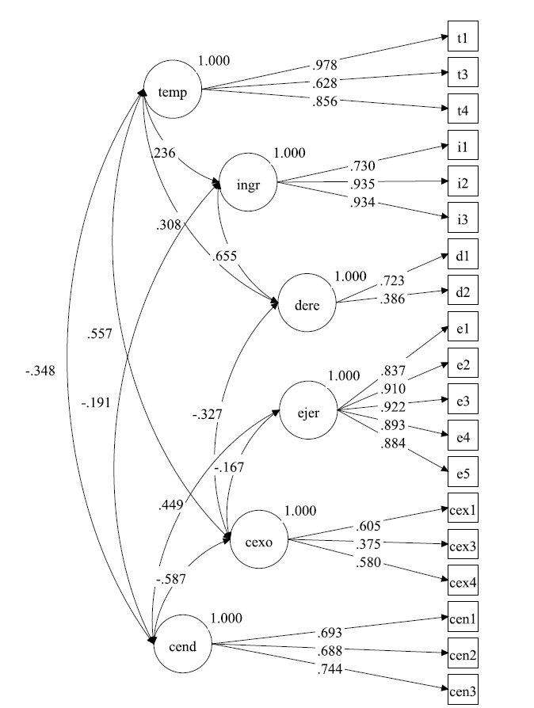
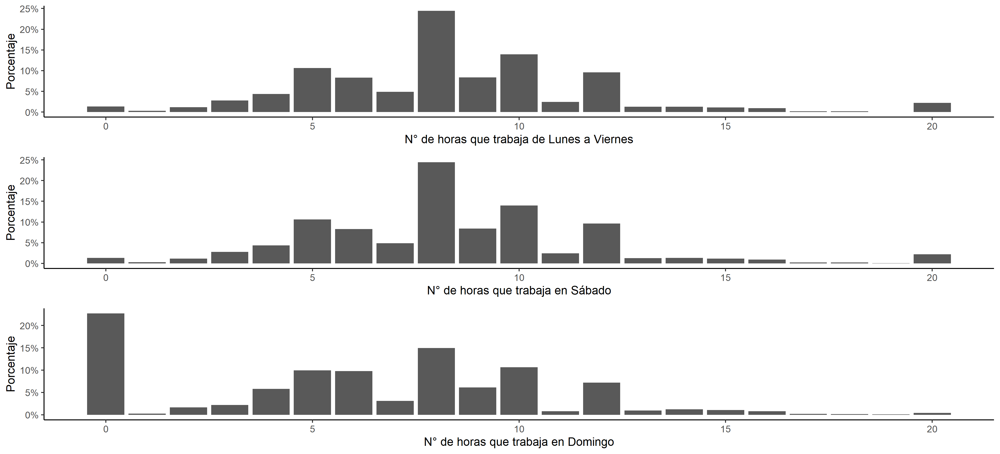
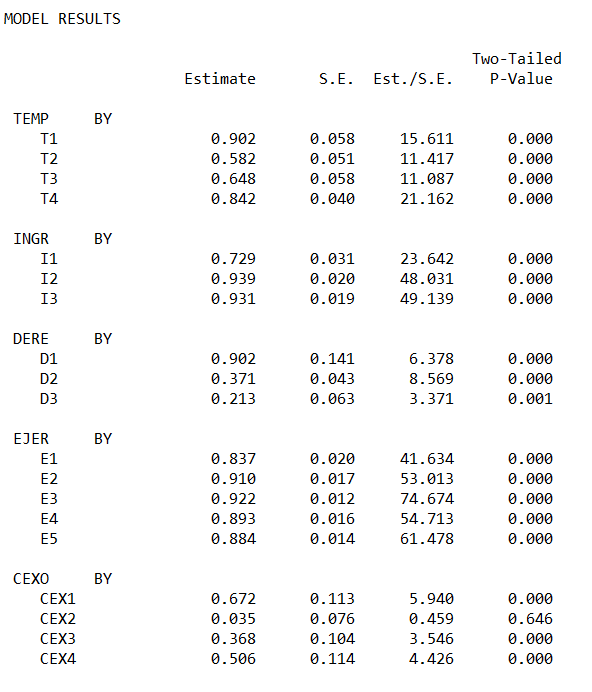

```{r setup, include=FALSE}
#options(kableExtra.auto_format = FALSE)   

knitr::opts_chunk$set(echo = TRUE)
```

 
# Introducción  

A pesar de estar clasificado dentro de los países de altos ingresos por el Banco Mundial y ser parte desde hace una década de la OCDE, Chile presenta un mercado laboral con características de economías aún en desarrollo, con altos niveles de informalidad y creciente subempleo (OCDE, 2015; OIT, 2018a). A modo más general, el mercado laboral chileno ha sido caracterizado por su extendida precariedad, incluyendo la falta de cobertura de protección social, bajos ingresos y la ausencia de contratos indefinidos, aspectos que a nivel individual tienen un efecto nocivo para la salud de los trabajadores (Ministerio de Salud, 2011; Vives et al., 2017). Además de la precariedad laboral, destaca el caso chileno por la alta proporción de trabajadores independientes (trabajadores por cuenta propia y pequeños empleadores), que durante los últimos años ha llegado a uno de cada cuatro ocupados, según estadísticas de la Encuesta Nacional de Empleo, proporción que casi triplica a la observada en las economías de ingresos altos (OIT, 2020).

El estudio conjunto de la precariedad laboral y el trabajo independiente o por cuenta propia, sin embargo, es escaso. Lo que suele observarse cuando se analiza la precariedad, es la realidad de los asalariados y en particular el debilitamiento de la relación salarial (Ruiz-Tagle & Sehnbruch, 2015; Vives et al., 2017), siguiendo las líneas de investigación de los países donde la asalarización se encuentra mucho más extendida que en América Latina. Por otra parte, frecuentemente se ha asimilado la precariedad de los trabajadores independientes con la informalidad (Temkin, 2009), categoría esta última que si bien puede describir la realidad de buena parte de los independientes, es imprecisa porque no representa exhaustivamente aquello que constituiría la precariedad específica de estos trabajadores (Jiménez, 2013; Wall, 2015). 

Dada la extensión del trabajo independiente en Chile y América Latina, y las múltiples formas que este ha adquirido en la actualidad a nivel global (Bögenhold, 2019; De Moortel & Vanroelen, 2017), es claro que un análisis específico de la precariedad laboral en este segmento de la fuerza de trabajo se hace necesario. Sin embargo, actualmente no se cuenta con instrumentos ni datos apropiados para la medición, ya que los marcos conceptuales desarrollados para el estudio de la precariedad -en los asalariados- son teórica y operacionalmente inadecuados para el análisis de los independientes. En efecto, los estudios realizados tanto en Chile (Gálvez, 2001, 2003; Jiménez, 2013) como en Europa y Norteamérica (Glavin et al., 2019; Kovesi & Kern, 2018; Oostveen et al., 2013; Pedersini & Coletto, 2009; Vosko, 2009) muestran que la precariedad es un problema relevante en el mundo de los trabajadores independientes, pero que tiene particularidades que obligan a conceptualizar y medir el fenómeno de una forma específica: por un lado, no hay empleadores, ni amenazas de despido; pero por otro, hay clientes demandantes, la amenaza de la quiebra y, en general, una ausencia de seguridad social como la que suele implicar el empleo asalariado formal. 

Comprender la precariedad laboral específicamente para los trabajadores independientes es relevante al menos por dos razones: por un lado, no podemos entender los efectos del empleo precario sobre los individuos que ocupan estos trabajos sin un adecuado marco conceptual y metodológico, o bien, interpretaríamos erróneamente la realidad de estos (Burchell, 1992). La segunda razón, es que en ausencia de esta comprensión específica, las políticas públicas diseñadas para enfrentar la precariedad no serían efectivas al no identificar adecuadamente el problema, su magnitud y sus causas (Temkin, 2009; Wall, 2015).

Este artículo, presenta una propuesta para la medición de la precariedad laboral en los trabajadores independientes que considere la especificidad de esta categoría ocupacional, a partir de la adaptación de la Escala de Precariedad Laboral aplicada en su versión chilena (EPRES-Ch) en la Encuesta Nacional de Condiciones de Empleo, Trabajo y Salud (ENETS) de los años 2009-2010, utilizando para la evaluación de la escala propuesta la técnica de análisis factorial confirmatorio de ítems, AFI (Wirth & Edwards, 2007). Complementando esta Introducción, se presentan los antecedentes conceptuales sobre el trabajo independiente, la precariedad laboral y una propuesta para su medición, basada en la EPRES-Ch. 


## Los trabajadores independientes

Bajo la categoría de trabajadores independientes conviven grupos diversos que ocupan posiciones de clase “contradictorias”, en tanto el mismo agente es a la vez propietario de los medios de producción y de trabajo, y trabajador directo (Poulantzas, 1973, p. 109; Wright, 1994). Es decir, habría en los trabajadores independientes un componente de clase dual: obreros y capitalistas; asalariados y empresarios, sin ser completamente ni uno ni otro en la medida que no entran en ninguna relación salarial, ya que la mayor parte del tiempo no venden ni compran fuerza de trabajo, sino que venden directamente los bienes y servicios que producen. 

La Clasificación Internacional de la Situación en el Empleo del año 1993 (CISE-93) retoma en gran medida estas definiciones, complementando que los trabajadores por cuenta propia pueden tener trabajadores de forma esporádica o temporal y pueden contar con la ayuda de trabajadores familiares auxiliares, y que, en cuanto independientes, son quienes “toman las decisiones operacionales que afectan a la empresa, o delegan tales decisiones, pero mantienen la responsabilidad por el bienestar de la empresa” (OIT, 1993) y cargan con el riesgo económico del negocio.

Por otra parte, a partir de la revisión de literatura sobre el trabajo independiente o por cuenta propia, es posible identificar a grandes rasgos dentro tres perspectivas teóricas que coinciden con tres grupos de trabajadores diferenciados según las motivaciones para trabajar como independiente y los mecanismos a través de los cuales acceden a los mercados en los que participan: por un lado, se encuentra una forma típicamente europea y de los segmentos más educados de la fuerza de trabajo, asociada a un desarrollo auténtico de iniciativas de independencia y emprendimiento, donde se pone en valor la autonomía y la realización personal con el trabajo (Benz & Frey, 2008), incluyendo, pero sin reducirse, al ideal neoclásico del empresario, “amante del riesgo” y con particulares habilidades empresariales (Lucas, 1978; Maloney, 2004; Montes-Rojas, 2010; Temkin, 2009). 

En segundo lugar, destaca una forma “adaptativa” o de subsistencia, propia de economías emergentes como las latinoamericanas y de los segmentos de menor escolaridad, donde el trabajador se encuentra en una situación de vulnerabilidad a la espera de un empleo dependiente protegido, y el trabajo por cuenta propia surge como alternativa al desempleo, asociándose por lo general a una condición de informalidad (Cea et al., 2009; Montes-Rojas, 2010; Temkin, 2009). Esta concepción proviene fundamentalmente de la teoría del mercado de trabajo dual donde las posibilidades de los individuos que terminan como trabajadores por cuenta propia se restringen al sector secundario (Basch & Paredes-Molina, 1996; Doeringer & Piore, 1975; Harris & Todaro, 1970), y la constatación de que gran parte de los independientes ha trabajado anteriormente como asalariado y que la prevalencia de este tipo de trabajo aumenta en períodos de crisis económica, cuando aumenta el desempleo (Cea et al., 2009; Jiménez, 2013; Montes-Rojas, 2010; Temkin, 2009).

Desde hace una década, aproximadamente, una tercera tipología se vuelve más nítida, que podría identificarse como la forma “neoliberal”, por cuanto responde a la desregulación de los marcos laborales y la expansión de la llamada economía colaborativa. Son los falsos independientes o bogus (Böheim & Mühlberger, 2009), dependientes periféricos (Gálvez, 2003), contratistas dependientes (OIT, 2018c), y con la aparición de las plataformas, gig workers (Friedman, 2014; Graham et al., 2017; Ravenelle, 2017), todos ellos diferentes, pero que comparten un origen común en la flexibilización del empleo, los importantes niveles de dependencia respecto a otras empresas que median el acceso al mercado y el cargar con parte importante del riesgo económico de esas empresas, pero sin acceder a una autonomía plena en el ejercicio del trabajo.

Estos tres grupos corresponden en rigor a tipos ideales que enfatizan cada uno rasgos comunes al conjunto de los trabajadores independientes. Para el caso chileno, por ejemplo, Jiménez (2013) destaca que la autonomía -como aquella que permite el control del tiempo propio- no es necesariamente sinónimo de emprendimiento, sino un rasgo común entre estos trabajadores. Asimismo, muchos de estos individuos entraron a la independencia a partir del desempleo y la ausencia de oportunidades como asalariados tradicionales, a partir de lo cual desarrollaron “emprendimientos”, o bien se emplearon como “dependientes periféricos”.


## Precariedad laboral
La precariedad laboral ha sido definida como la fragilización de la relación salarial a partir de la flexibilidad laboral que refleja (o intensifica) una asimetría en las relaciones de poder que definen el marco de las relaciones laborales (Amable, 2004; Cano, 1998, 2004). Representa una situación de vulnerabilidad de la continuidad y control del empleo y la profesión que reduce la capacidad y autonomía de los trabajadores (Cano, 1998). El trabajo precario le impide al sujeto trabajador vivir satisfaciendo todas sus necesidades materiales, trabajar sin riesgos psicosociales o de sufrir accidentes, a la vez que le imposibilita tener certezas y protección social en caso de enfermedad y/o jubilación (Benach et al., 2014; Blanco & Julián, 2019; Castel, 2010). Las formas precarias del trabajo implican una degradación de las condiciones de trabajo durante la vida laboral que se experimenta como un “sentimiento de pérdida”, una constante amenaza de despido, y una inserción intermitente en el mercado de trabajo (Bayón, 2006; Guadarrama et al., 2012; Paugam & Zhou, 2007). Normalmente, son los individuos que cuentan con menos recursos y habilidades útiles para el mercado laboral los que acceden a empleos más precarios, insertándose en una espiral de precariedad y exclusión social que en el contexto neoliberal se vuelven un rasgo constitutivo de las sociedades (Bayón, 2006; Castel, 1997; Gallie & Paugam, 2000).

En cuanto dimensión psicosocial, la precariedad se sitúa en el espacio intersubjetivo de la vida cotidiana en el trabajo y en las relaciones sociales que en ese espacio se generan (Amable, 2004; Dejours, 2006), y entre otras cosas, “bloquea” los efectos positivos del empleo y genera efectos dañinos sobre la salud (Benach et al., 2014; Neffa, 2015). Precisamente con relación a la salud y la calidad de vida de los trabajadores, se ha encontrado evidencia contundente respecto al carácter nocivo de la precariedad en desenlaces tan variados como depresión, enfermedades cardiovasculares, dolores musculoesqueléticos, entre otros (Benach et al., 2014; Vives et al., 2019). 

En base a estas ideas y evidencia, Amable y otros desarrollaron en España un instrumento para medir multidimensionalmente la precariedad, al que denominaron Escala de Precariedad Laboral (EPRES), para la investigación en salud. La escala mide en trabajadores asalariados seis dimensiones de la precariedad: temporalidad del contrato, suficiencia de los ingresos, cobertura en derechos y protección social, capacidad para ejercer derechos relacionados con el uso del tiempo, desempoderamiento o individualización de la negociación de las condiciones de trabajo, y vulnerabilidad o indefensión al trato abusivo en el espacio laboral (Amable, 2004; Vives et al., 2017). Más allá de su enfoque en el estudio de la relación entre precariedad y salud, la perspectiva multidimensional de la EPRES  la transforma en un instrumento potente para el análisis y monitoreo de la situación de los trabajadores, a nivel individual, y de las características del mercado de trabajo, a nivel general. Sin embargo, la utilidad y generalidad de la EPRES se relativiza al considerar la precariedad laboral como un fenómeno transclasista, que fluye por todo el mercado de trabajo (Blanco & Julián, 2019), y que se expresa de forma específica en los empleos no asalariados.


## Una propuesta para la medición de la precariedad en los trabajadores independientes

Como ya se ha señalado, analíticamente los trabajadores independientes presentan al mismo tiempo características de los asalariados y de los empleadores (Wright, 1994). Compartirían con los asalariados, entonces, las fuentes de la precariedad capturadas en las dimensiones comunes de la Escala de Precariedad Laboral, que son las que no implican necesariamente una relación salarial: temporalidad, ingresos, derechos y ejercicio de derechos. Pero, por otra parte, los trabajadores por cuenta propia se ven expuestos en su calidad de poseedores de los medios de producción a otras fuentes de la precariedad que, grosso modo, pueden distinguirse en dos grupos: la eventual falta de independencia para controlar el proceso productivo, que es controlado por otro -exógeno- o por el ritmo del negocio -endógeno-, y la carencia de protección frente a los riesgos que por definición los dueños del capital asumen.

Respecto a la falta de independencia por el control exógeno del proceso productivo, Gálvez (2001) propone el concepto de “dependiente periférico” para identificar a los trabajadores que son jurídicamente independientes (no contratados como asalariados), pero en los hechos están sometidos a relaciones de dependencia más o menos evidentes respecto a otra entidad, y no concurren libremente al mercado de bienes/servicios que producen, sino que lo hacen a través de un tercero que compra toda o gran parte de la producción y/o que puede normar las formas de producción (jornada, precios, procesos, etc.). En Europa, estos trabajadores “económicamente dependientes” muestran peores condiciones de acceso a la seguridad social, menores ingresos y mayor inseguridad laboral que los empleadores y otros trabajadores por cuenta propia (Oostveen et al., 2013). El control exógeno constituiría precariedad por cuanto estos trabajadores reconocerían en la independencia y autonomía la cara positiva del trabajo por cuenta propia (Benz & Frey, 2008), y en el control externo, lo opuesto (Jiménez, 2013), asociando la falta de independencia a insatisfacción con el trabajo (Böheim & Mühlberger, 2009). 

Pero la falta de independencia en el control del proceso productivo también puede ser endógena, originándose en el propio proceso productivo. En efecto, los ritmos de la producción y comercialización de bienes y servicios pueden impedir una reproducción saludable de los ritmos biológicos y sociales del trabajador, obligándolo a intensidades de trabajo indeseables o incompatibles con la vida familiar cuyos efectos sobre la salud ya han sido demostrados entre los trabajadores asalariados (Artazcoz et al., 2007; Mcnamara et al., 2011). En el caso de los independientes, al ser el propio trabajador el responsable del éxito de la empresa y quien carga el riesgo económico, todos los aspectos del proceso productivo y comercial quedan a cargo de un solo individuo, lo que fácilmente puede traducirse en una incapacidad de regular las horas de trabajo y separarlas del tiempo de descanso. Así, por ejemplo, entre los trabajadores por cuenta propia se han observado mayores dificultades para conciliar la vida familiar con el trabajo (Binder & Coad, 2013; Blanchflower, 2004; Parasuraman & Simmers, 2001). El rasgo más saliente de esta falta de control sobre el proceso productivo sería la excesiva extensión de la jornada de trabajo, lo que Blanco y Julián (2019) han denominado “cronopiedad”, y que se expresaría tanto en una alta cantidad de horas de trabajo realizadas semanalmente, así como también el trabajo en días generalmente destinados al descanso, como los sábados y domingos.

El riesgo económico, por su parte, es un elemento constitutivo de la independencia, tal como señala la definición operacional de la CISE-93. Administrar el riesgo implica tomar todas las acciones necesarias para salvaguardar los bienes de la empresa ante posibles pérdidas derivadas de la actividad (Verbano & Venturini, 2013), y en este sentido, no es el riesgo lo que definiría la situación de precariedad, sino la falta de protección frente al mismo. También en este caso hay dos dimensiones: la ausencia de protección frente al riesgo de carácter dinámico, referido a la posibilidad de obtener pérdidas económicas como consecuencia de la incertidumbre asociada a la adopción de ciertas acciones, y la ausencia de protección frente al riesgo de carácter estático, referido al riesgo indeterminado, sin posibilidad de obtener ganancia, asociado a los accidentes que afectan los recursos de la empresa (Verbano & Venturini, 2013). Ambas fuentes de riesgo suponen que el trabajador independiente debería adoptar medidas de protección, tendientes tanto a separar los efectos negativos que el riesgo dinámico puede suponer para la reproducción del trabajador por la variabilidad de las ventas o la quiebra de la empresa, como a asegurar al negocio frente a las eventualidades del riesgo estático.

De este modo, se proponen las siguientes definiciones de las dimensiones específicas de la precariedad para los trabajadores independientes, complementarias a las dimensiones comunes con los asalariados:

+ El control exógeno de las condiciones de trabajo, derivado de la inconsistencia entre la independencia jurídica y la heteronorma de hecho producto de un alto grado de encadenamiento hacia adelante (clientes) y hacia atrás (proveedores) en la que podría encontrarse el trabajador. En el extremo, la independencia puede ser sólo jurídica cuando el trabajador tiene una relación de exclusividad y su actividad se encuentra normada tanto como la de un trabajador dependiente de la empresa cliente, pero sin acceder a los beneficios del empleo asalariado.

+ El control endógeno de las condiciones de trabajo, como consecuencia del dominio que el proceso productivo propio del negocio ejerce sobre el trabajador independiente, y que se manifiesta en la extensión e intensidad de la jornada de trabajo. Como ideal, se esperaría que el ritmo y el tiempo de trabajo sea similar al que social y legalmente se ha establecido como norma para los asalariados clásicos.

+ La ausencia de protección frente al riesgo de carácter dinámico traería como consecuencia la inestabilidad en los ingresos del trabajador y su hogar, como consecuencia del flujo variable de ingresos y la no separación de los ingresos de la empresa y del trabajador, por ejemplo, mediante la formalización del negocio.

+ La ausencia de protección frente al riesgo de carácter estático se manifestaría en la falta de aseguramiento económico frente a accidentes u otras eventualidades que afecten al capital invertido por la empresa (instalaciones, maquinaria, herramientas, insumos, etc.).

De estas definiciones es posible derivar indicadores medibles de la precariedad específica de los trabajadores independientes. Sin embargo, en la ENETS no se encuentran indicadores para evaluar las dimensiones asociadas a la protección frente al riesgo económico dinámico y estático (por ejemplo, variables como la formalización tributaria, separación de los ingresos de la empresa y del hogar, o la contratación de seguros frente a accidentes que afecten el capital) . En cambio, sí se encuentran preguntas que se acercarían a la medición del grado de encadenamiento y normatividad del trabajo como indicador del control exógeno, y también preguntas sobre la extensión de la jornada de trabajo que darían cuenta del control endógeno. Cabe recordar, por último, que la propuesta incluye, además de estas dimensiones, las cuatro presentes en la EPRES-Ch y comunes a los asalariados. Las preguntas propuestas para medir cada dimensión se presentan en la sección siguiente.


# Método          	

La Encuesta Nacional de Condiciones de Empleo, Trabajo y Salud fue realizada por el Ministerio de Salud de Chile, y corresponde a una encuesta transversal representativa a nivel nacional, de los sectores urbano y rural, de cada una de las 15 regiones existentes al año 2009 y de la población de 15 años o más que tuvo algún trabajo remunerado durante los 12 meses anteriores al empadronamiento. El trabajo de campo se realizó entre los meses de septiembre de 2009 y octubre de 2010, obteniendo una tasa de respuesta del 73,9% (Solar et al., 2010). A pesar de haber pasado poco más de una década, esta es la única encuesta representativa a nivel nacional que incluye las EPRES-Ch además de variables ocupacionales, sociodemográficas y de salud suficientes para analizar la precariedad laboral de los trabajadores independientes. 

La base de la ENETS 2009-2010 (MINSAL, 2016) está compuesta por 9.503 casos, los que representan a casi 7,4 millones de trabajadores. De entre los trabajadores ocupados (8.356) se seleccionaron a los que calificaron como trabajadores independientes, es decir, los trabajadores por cuenta propia o empleadores de hasta 5 trabajadores no permanentes , los cuales sólo pueden corresponder a familiares, trabajadores no remunerados o socios. Con esta selección se obtuvo un total de 2.115 casos (que corresponden a un universo estimado de 1,54 millones de trabajadores): 1.639 trabajadores por cuenta propia sin empleados y 476 empleadores. 

Para el análisis, se utilizaron 22 variables agrupadas en 6 dimensiones: 15 ítems correspondientes a las cuatro dimensiones comunes de la precariedad entre asalariados e independientes medidas en la EPRES-Ch, y 7 ítems de las dos dimensiones propuestas para la medición del control exógeno y endógeno del proceso productivo, únicas dimensiones para las cuales se identificaron preguntas pertinentes en la ENETS. 

En un primer momento se realizó un análisis descriptivo de las variables incluidas en el modelo, y posteriormente, para determinar el ajuste del modelo de factores propuesto, se realizó un análisis factorial confirmatorio en su modalidad análisis factorial de ítems (AFI), que revela la estructura multidimensional de un constructo complejo y latente, como la precariedad laboral. El AFI es útil para variables categóricas como las empleadas, incluso con distribuciones altamente asimétricas (Rdz-Navarro & Asún, 2016). Se utilizó el WLSMV (weighted least square mean and variance) como estimador de las correlaciones, apropiado para datos categóricos y muestras relativamente grandes (n ≥ 1000) (Lloret-Segura et al., 2014). Finalmente, a partir de los resultados del AFI se evaluó la fiabilidad (varianza común de los ítems del factor) de las dimensiones teóricas a través del alfa para datos categóricos ordenados (Elosua & Zumbo, 2008).  Para la preparación de los datos y el análisis descriptivo se utilizó el software R 3.6.3 (R Core Team, 2020), y para el análisis factorial Mplus 7.4 (Muthén & Muthén, 2015). Los datos y el código utilizado en R y MPLUS están disponibles en el [repositorio de GitHub](https://github.com/nicolasrattor/Escala_precariedad_informales) del proyecto.

```{r echo=FALSE,message=FALSE,warning=FALSE, results=FALSE}

## Paquetes
library(tidyverse)
library(haven)

## Descargado desde:
## http://epi.minsal.cl/wp-content/uploads/2016/10/ENETS_2009-2010_TRABAJADOR_SPSS_VERSION.rar

## Cargar ENETS
enets<-read_spss("Input/BBDD/ENETS_2009-2010_TRABAJADOR_SPSS_VERSION/ENETS 2009-2010 TRABAJADOR CON FE.sav")
#observaciones:
nrow(enets)

#### Selección de la muestra ####
# Filtro muestra 22: TPCP y empleadores de hasta 5 trabajadores no permanentes = 1; Resto ocupados = 0.
enets<- mutate(enets, muestra22 = case_when((a0==1 | a1==1 | a2==1) & 
                                              (a5==1 | a5==2) & (a6<6) & 
                                              (a37==1| a37==2 | a37==3 | a37==5) ~1,
                                            (a0==1 | a1==1 | a2==1) ~ 0,
                                          TRUE ~ NA_real_))

enets$fmuestra22<- factor(enets$muestra22, labels = c("No independientes", "Independientes"))


## Editar variables

#Sexo
enets$e2<- factor(enets$e2, labels=c("Hombre", "Mujer"))

#Grupo etario
enets<- mutate(enets, edad_4g = car::recode(enets$a52,
                                            "15:24=1; 25:44=2; 45:64=3; 65:99=4"))

enets$edad_4g<-factor(enets$edad_4g, labels=c("15-24", "25-44", "45-64", "65 y más"))

#Nivel educacional
enets<- mutate(enets, niv_educ = car::recode(enets$f2t,
                                             "1:4=1; 5:8=2; 9:12=3; 13:15=4; 16=1; else=NA"))
enets$niv_educ<-factor(enets$niv_educ, labels=c("Básica", "Media", "Técnica", "Universitaria"))

#Ocupación (CIUO88)
enets<-enets %>% mutate(a7ciuo1d=substr(a7ciuo, start = 1, stop = 1))
table(enets$a7ciuo1d)

enets %>% select(a7,a7ciuo,a7ciuo1d)

enets$a7ciuo1d<-factor(enets$a7ciuo1d, labels=c("FFAA",
                                                "Directivos y gerentes", 
                                                "Profesionales, científicos e intelectuales",
                                                "Técnicos profesionales de nivel medio", 
                                                "Empleados de oficina", 
                                                "Trabajadores de servicios y vendedores de comercio y mercado",
                                                "Agricultores y trabajadores calificados agropecuarios y pesqueros", 
                                                "Oficiales, operarios y artesanos de artes mecánicas y de otros oficios",
                                                "Operadores de instalaciones y máquinas montadores", 
                                                "Trabajadores no calificados"))

#Actividad económica
enets<-enets %>% mutate(a8ciiu1d=substr(a8ciiu, start = 1, stop = 1))
table(enets$a8ciiu1d,useNA = "ifany")
enets$a8ciiu1d<-factor(enets$a8ciiu1d, labels=c("Actividades no bien especificadas", 
                                                "Agricultura, caza, silvicultura", 
                                                "Explotación de minas y canteras", 
                                                "Industrias manufactureras",
                       "Electricidad, Agua y Gas", 
                       "Construcción", 
                       "Comercio, restaurantes y hoteles",
                       "Transporte y comunicaciones", 
                       "Establecimientos financieros", 
                       "Servicios comunales sociales"))

#Ingresos
enets<- mutate(enets, ingresos = car::recode(enets$a48,
                                           "1=1; 2:3=2; 4:5=3; 6:7=4; 8:11=5; else=NA"))
enets$ingresos<- factor(enets$ingresos, labels=c("Menos de $64.000 (US$125)", "Entre $64.000 (US$125) y $180.000 (US$345)", 
                                                 "Entre $180.000 (US$345) y $350.000 (US$675)", "Entre $350.000 (US$675) y $650.000 (US$1.250)",
                                                 "Más de $650.000 (US$1.250)"))


#Etiquetas variables
#enets = apply_labels(enets,
#                     e2="Sexo",
#                     edad_4g="Grupo etario",
#                     niv_educ="Nivel educacional",
#                     a8ciiu1d="Perfil de la ocupación (CIUO-88)",
#                     a7ciuo1d="Actividad económica (CIIU)",
#                     ingresos="Tramo de ingresos mensuales del trabajo")

#enets_full<-enets
#enets<-filter(enets, muestra22==1)

nrow(enets)
enets_full<-enets
enets<-enets %>% filter(muestra22==1)
nrow(enets)

#Tabla 1. 
library(summarytools)
demograficas<-enets%>%select(e2, edad_4g, niv_educ, a7ciuo1d, a8ciiu1d, ingresos)
view(freq(demograficas, report.nas = FALSE, totals = FALSE, round.digits = 1, 
     cumul = FALSE, headings = F, display.type = FALSE))

view(freq(demograficas, report.nas = FALSE, totals = FALSE, round.digits = 1, 
     cumul = FALSE, headings = F, display.type = FALSE, weights = enets$FEXP_MAY15))


view(ctable(enets_full$e2, enets_full$fmuestra22, prop = "c", useNA = "no", totals = F, round.digits = 1, headings=F, 
             weights = enets_full$FEXP_MAY15, rescale.weights = T, chisq = T))
view(ctable(enets_full$edad_4g, enets_full$fmuestra22, prop = "c", useNA = "no", totals = F, round.digits = 1, headings=F, 
             weights = enets_full$FEXP_MAY15, rescale.weights = T, chisq = T))
view(with(enets_full, stby(a52, fmuestra22, descr, stats=c("common"), weights = enets_full$FEXP_MAY15, rescale.weights = T,
                           na.rm=TRUE)))
view(ctable(enets_full$niv_educ, enets_full$fmuestra22, prop = "c", useNA = "no", totals = F, round.digits = 1, headings=F, 
             weights = enets_full$FEXP_MAY15, rescale.weights = T, chisq = T))
view(ctable(enets_full$a7ciuo1d, enets_full$fmuestra22, prop = "c", useNA = "no", totals = F, round.digits = 1, headings=F, 
             weights = enets_full$FEXP_MAY15, rescale.weights = T, chisq = T))
view(ctable(enets_full$a8ciiu1d, enets_full$fmuestra22, prop = "c", useNA = "no", totals = F, round.digits = 1, headings=F, 
             weights = enets_full$FEXP_MAY15, rescale.weights = T, chisq = T))
view(ctable(enets_full$ingresos, enets_full$fmuestra22, prop = "c", useNA = "no", totals = F, round.digits = 1, headings=F, 
             weights = enets_full$FEXP_MAY15, rescale.weights = T, chisq = T))


#### CONSTRUCCIÓN INDICADORES ESCALAS EPRES (basado en VIVES ET AL 2017) ####

#### 1. TEMPORALIDAD #### 

# T1. Meses desempleado en el año anterior----

enets<- mutate(enets, T1 = case_when(a54==1 | a62a==2 | a64==1 ~ 0,
                                   a64==2 ~ 1, 
                                   a64==3 ~ 2, 
                                   a64==4 ~ 3, 
                                   a64==5 ~ 4, 
                                   TRUE ~ NA_real_))

#var_lab(enets$T1) = "Meses desempleado en el año anterior"
#val_lab(enets$T1) = num_lab("
#0 No ha estado desempleado
#1 Menos de 2 meses
#2 De 2 a menos de 3 meses
#3 De 3 a menos de 6 meses
#4 De 6 a menos de 12 meses
#")

enets$fT1<-factor(enets$T1)
#var_lab(enets$fT1) = "Meses desempleado en el año anterior"

#T2.Percepción de estabilidad en el empleo----

enets<- mutate(enets, T2=case_when(a21==1 ~ 0,
                                   a21==2 ~ 1,
                                   a21==3 ~ 2, 
                                   TRUE ~ NA_real_))
#var_lab(enets$T2) = "Percepción de estabilidad en el empleo"
#val_lab(enets$T2) = num_lab("
#0 Estable, seguro en el futuro
#1 Estable, seguro en este momento
#2 Inestable (a veces, no sabe ni por cuánto tiempo ni para qué actividad)
#")

enets$fT2<-factor(enets$T2)
#var_lab(enets$fT2) = "Percepción de estabilidad en el empleo"

#T3. Temporalidad del trabajo----

enets<-mutate(enets, T3 = case_when (a22==1 ~ 0,
                                     a22==2 ~ 1,
                                     TRUE ~ NA_real_))

#var_lab(enets$T3) = "Temporalidad del trabajo"
#val_lab(enets$T3) = num_lab("
#0 Permanente
#1 De temporada o estacional
#")

enets$fT3<-factor(enets$T3)
#var_lab(enets$fT3) = "Temporalidad del trabajo"

#T4. Tiempo en el actual trabajo ----

enets<-mutate(enets, T4 = case_when(a23==1 ~ 4,
                                    a23==2 ~ 3,
                                    a23==3 ~ 2,
                                    a23==4 | a23==5 ~ 1,
                                    a23==6 ~ 0,
                                    TRUE ~ NA_real_))

#var_lab(enets$T4) = "Tiempo en el actual trabajo"
#val_lab(enets$T4) = num_lab("
#0 Más de 10 años
#1 Entre 3 y 10 años
#2 Entre 1 y 3 años
#3 Entre 6 meses y 1 año
#4 Menos de 6 meses
#")

enets$fT4<-factor(enets$T4)
#var_lab(enets$fT4) = "Tiempo en el actual trabajo"

#### 2. INGRESOS #### 

#I1. Ingreso mensual del trabajo----

enets<-mutate(enets, I1 = case_when(a48>7 & a48<13 ~ 0,
                                    a48==6 | a48==7 ~ 1,
                                    a48==4 | a48==5 ~ 2,
                                    a48>0 & a48<4 ~ 3,
                                    TRUE ~ NA_real_))

#var_lab(enets$I1) = "Tramo de ingreso líquido mensual del trabajo"
#val_lab(enets$I1) = num_lab("
#                              0 Más de $650.000 (US$1.250)
#                              1 Entre $350.000 y $650.000 (US$675-US$1.250)
#                              2 Entre $180.000 y $350.000 (US$345-US$675)
#                              3 Menos de $180.000 (US$345)
#                              ")

enets$fI1<-factor(enets$I1)
#var_lab(enets$fI1) = "Tramo de ingreso líquido mensual del trabajo"

#I2. Suficiencia de ingresos para cubrir gastos básicos----

enets<- mutate(enets, I2 = case_when(a50==1 ~ 0,
                                     a50==2  ~ 1,
                                     a50==3  ~ 2,
                                     a50==4  ~ 3,
                                     TRUE ~ NA_real_))

#var_lab(enets$I2) = "Suficiencia de ingresos para cubrir gastos básicos"
#val_lab(enets$I2) = num_lab("
 #                           0 Siempre
  #                          1 Casi siempre
   #                         2 Rara vez
    #                        3 Nunca")
enets$fI2<-factor(enets$I2)
#var_lab(enets$fI2) = "Suficiencia de ingresos para cubrir gastos básicos"

#I3. Suficiencia de ingresos para cubrir gastos imprevistos----

enets<- mutate(enets, I3 = case_when(a50a==1 ~ 0,
                                     a50a==2  ~ 1,
                                     a50a==3  ~ 2,
                                     a50a==4  ~ 3,
                                     TRUE ~ NA_real_))

#var_lab(enets$I3) = "Suficiencia de ingresos para cubrir gastos imprevistos"
#val_lab(enets$I3) = num_lab("
#                            0 Siempre
 #                           1 Casi siempre
  #                          2 Rara vez
   #                         3 Nunca")
enets$fI3<-factor(enets$I3)
#var_lab(enets$fI3) = "Suficiencia de ingresos para cubrir gastos imprevistos"

#### 3. DERECHOS ####

#D1. Afiliado y cotiza para jubilación----

enets<- mutate(enets, D1 = case_when(a70 < 6 & a71==1 ~ 0,
                                     (a70 < 6 & a71==2) | a70==6  ~ 1,
                                     (a70==88 | a71==88) ~ 2,
                                     TRUE ~ NA_real_))

#var_lab(enets$D1) = "Afiliado y cotiza para jubilación"
#val_lab(enets$D1) = num_lab("
 #                           0 Afiliado y cotiza
  #                          1 No afiliado o no cotiza
   #                         2 No sabe")

enets$fD1<- factor(enets$D1)
#var_lab(enets$fD1) = "Afiliado y cotiza para jubilación"

#D2. Tiene seguro de cesantía----

enets<-mutate(enets, D2 = case_when(a73==1 ~ 0,
                                    a73==2 ~ 1,
                                    a73==88 ~ 2,
                                    TRUE ~ NA_real_))

#var_lab(enets$D2) = "Tiene seguro de cesantía"
#val_lab(enets$D2) = num_lab("
 #                            0 Sí
  #                           1 No
   #                          2 No sabe")

enets$fD2<- factor(enets$D2)
#var_lab(enets$fD2) = "Tiene seguro de cesantía"

#D3. Afiliado y cotiza o es carga de sistema de salud----

enets<- mutate(enets, D3 = case_when(a72<8 | a72==9 ~ 0,
                                     a72==8 ~ 1,
                                     a72==88 ~ 2,
                                     TRUE ~ NA_real_))

#var_lab(enets$D3) = "Afiliado y cotiza o es carga de sistema de salud"
#val_lab(enets$D3) = num_lab("
 #                            0 Sí
  #                           1 No
   #                          2 No sabe")

enets$fD3<- factor(enets$D3)
#var_lab(enets$fD3) = "Afiliado y cotiza o es carga de sistema de salud"

#### 4. EJERCICIO DE DERECHOS ####

#E1. Tomarse los días feriados----

enets<- mutate(enets, E1 = case_when(a67a==4 ~ 0,
                                     a67a==3 ~ 1,
                                     a67a==2 ~ 2,
                                     a67a==1 ~ 3,
                                     TRUE ~ NA_real_))

#var_lab(enets$E1) = "Tomarse los días feriados"
#val_lab(enets$E1) = num_lab("
 #                           0 Siempre
  #                          1 Casi siempre
   #                         2 Rara vez
    #                        3 Nunca")

enets$fE1 <- factor(enets$E1)
#var_lab(enets$fE1) = "Tomarse los días feriados"

#E2. Hacer uso de licencia médica o reposo----

enets<- mutate(enets, E2 = case_when(a67b==4 ~ 0,
                                     a67b==3 ~ 1,
                                     a67b==2 ~ 2,
                                     a67b==1 ~ 3,
                                     TRUE ~ NA_real_))

#var_lab(enets$E2) = "Hacer uso de licencia médica o reposo"
#val_lab(enets$E2) = num_lab("
 #                           0 Siempre
  #                          1 Casi siempre
   #                         2 Rara vez
    #                        3 Nunca")

enets$fE2 <- factor(enets$E2)
#var_lab(enets$fE2) = "Hacer uso de licencia médica o reposo"


#E3. Ir al médico cuando lo necesita----

enets<- mutate(enets, E3 = case_when(a67c==4 ~ 0,
                                     a67c==3 ~ 1,
                                     a67c==2 ~ 2,
                                     a67c==1 ~ 3,
                                     TRUE ~ NA_real_))

#var_lab(enets$E3) = "Ir al médico cuando lo necesita"
#val_lab(enets$E3) = num_lab("
 #                           0 Siempre
  #                          1 Casi siempre
   #                         2 Rara vez
    #                        3 Nunca")

enets$fE3 <- factor(enets$E3)
#var_lab(enets$fE3) = "Ir al médico cuando lo necesita"

#E4. Tomar las vacaciones----

enets<- mutate(enets, E4 = case_when(a67d==4 ~ 0,
                                     a67d==3 ~ 1,
                                     a67d==2 ~ 2,
                                     a67d==1 ~ 3,
                                     TRUE ~ NA_real_))

#var_lab(enets$E4) = "Tomar las vacaciones"
#val_lab(enets$E4) = num_lab("
#                            0 Siempre
 #                           1 Casi siempre
  #                          2 Rara vez
   #                         3 Nunca")

enets$fE4 <- factor(enets$E4)

#var_lab(enets$fE4) = "Tomar las vacaciones"


#E5. Pedir o tomarse un día libre por motivos familiares o personales----

enets<- mutate(enets, E5 = case_when(a67e==4 ~ 0,
                                     a67e==3 ~ 1,
                                     a67e==2 ~ 2,
                                     a67e==1 ~ 3,
                                     TRUE ~ NA_real_))

#var_lab(enets$E5) = "Pedir o tomarse un día libre por motivos familiares o personales"
#val_lab(enets$E5) = num_lab("
 #                           0 Siempre
#                          1 Casi siempre
 #                           2 Rara vez
  #                          3 Nunca")

enets$fE5 <- factor(enets$E5)
#var_lab(enets$fE5) = "Pedir o tomarse un día libre por motivos familiares o personales"


#### 5. CONTROL EXOGENO ####

#CEX1. Número de clientes durante el último mes----

enets<- mutate(enets, CEX1 = case_when(a32==1 ~ 1,
                                       a32==2 ~ 0,
                                       TRUE ~ NA_real_))

#var_lab(enets$CEX1) ="Número de clientes durante el último mes"
#val_lab(enets$CEX1) = num_lab("
 #                             1 Un cliente fijo
  #                            0 Más de un cliente")

enets$fCEX1 <- factor(enets$CEX1)
#var_lab(enets$fCEX1) ="Número de clientes durante el último mes"

#CEX2. Número de proveedores durante el último mes----

enets<-mutate(enets, CEX2 = case_when(a33<3 ~ 2,
                                      a33==3 ~ 1,
                                      a33==4 ~ 0,
                                      TRUE ~ NA_real_))

#var_lab(enets$CEX2) = "Número de proveedores durante el último mes"
#val_lab(enets$CEX2) = num_lab("
 #                             0 No tiene relación con proveedor principal
  #                            1 Varios proveedores principales
   #                           2 Un proveedor principal o fijo")

enets$fCEX2 <- factor(enets$CEX2)
#var_lab(enets$fCEX2) = "Número de proveedores durante el último mes"


#CEX3. La manera de trabajar está normada por cliente o proveedor----

enets<-mutate(enets, CEX3 = case_when(a35==1 ~ 1,
                                      a35==2 ~ 0,
                                      TRUE ~ NA_real_))
#var_lab(enets$CEX3)= "La manera de trabajar está normada por cliente o proveedor"
#val_lab(enets$CEX3)= num_lab("
#                             0 No
#                             1 Sí")

enets$fCEX3<- factor(enets$CEX3)
#var_lab(enets$fCEX3)= "La manera de trabajar está normada por cliente o proveedor"


#CEX4. Tiene exclusividad con cliente o proveedor----

enets<-mutate(enets, CEX4 = case_when(a36==1 ~ 1,
                                      a36==2 ~ 0,
                                      TRUE ~ NA_real_))

#var_lab(enets$CEX4)= "Tiene exclusividad con cliente o proveedor"
#val_lab(enets$CEX4)= num_lab("
#                             0 No
#                             1 Sí")

enets$fCEX4<- factor(enets$CEX4)
#var_lab(enets$fCEX4)= "Tiene exclusividad con cliente o proveedor"

#### 6. CONTROL ENDOGENO ####
#Se testearon varias versiones de estas tres variables y también de a44, observándose altas correlaciones entre a43 y a44, y entre a41 y a42
#También se observó que la sobrejornada (mayor a 45 horas) estaba principalmente explicada por trabajo de LaV, y no por sábado o domingo, de modo que sería redundante incluirla por separado.
#La lógica es que alguien que supera las 9 horas diarias de LaV, presenta sobretrabajo, y que quien trabaja sábado o domingo, también, ya que prácticamente nadie no trabaja de LaV.
#Es decir, quien trabaja S o D, trabaja 6 o 7 días, lo que es sobretrabajo. Sólo no lo sería si es que trabajara pocas horas de LaV.

#enets <- enets %>% mutate(horassem = (5*a41)+a42+a43)
#enets<- mutate(enets, diassem = case_when(a41>0 & a42>0 & a43>0 ~ 7,
 #                                         a41>0 & a42>0 & a43==0 ~ 6,
  #                                        a41>0 & a42==0 & a43>0 ~ 6,
   #                                       a41>0 & a42==0 & a43==0 ~ 5,
    #                                      a41==0 & a42>0 & a43>0 ~ 2,
     #                                     a41==0 & a42==0 & a43>0 ~ 1,
      #                                    a41==0 & a42>0 & a43==0 ~ 1,
       #                                   a41==0 & a42==0 & a43==0 ~ 0,
        #                                  TRUE ~ NA_real_))
#enets <- enets %>% mutate(horassemcat = case_when(horassem<=45~0,
 #                                                 horassem>45~1,
  #                                                TRUE~NA_real_))

#view(ctable(enets$horassemcat, enets$diassem, weights = enets$FEXP_MAY15, prop= "r"))


#CEN1. (N° de horas) sobre 9 horas que trabaja de Lunes a Viernes----

#enets<- mutate(enets, CEN1 = case_when(a41<=9 ~ 0,
 #                                   a41==10 ~ 1,
 #                                   a41==11 ~ 2,
 #                                   a41==12 ~ 3,
 #                                   a41==13 ~ 4,
 #                                   a41==14 ~ 5,
 #                                   a41==15 ~ 6,
 #                                   a41==16 ~ 7,
 #                                   a41==17 ~ 8,
 #                                   a41==18 ~ 9,
 #                                   a41==19 ~ 10,
 #                                   a41==20 ~ 11,
 #                                       TRUE ~ NA_real_))
#var_lab(enets$CEN1)= "N° de horas sobre 9 horas que trabaja de Lunes a Viernes"
#library(rapportools)
#kurtosis(enets$sqCEN1, na.rm=T)
#skewness(enets$sqCEN1, na.rm=T)

#enets$sqCEN1<-sqrt(enets$CEN1)
#var_lab(enets$CEN1)= "N° de horas sobre 9 horas que trabaja de Lunes a Viernes (raíz)"

enets<- mutate(enets, CEN1 = case_when(a41<=9 ~ 0,       # Esta es la versión dicotómica de la variable construida el 16-3-21,
                                       a41>9 ~ 1,        # como alternativa para evitar problemas dada la mala distribución de la variable
                                       TRUE ~ NA_real_)) # y la concentración en valor cero##

#var_lab(enets$CEN1)= "En promedio, trabaja de Lunes a Viernes más de 9 horas diarias"
#val_lab(enets$CEN1)= num_lab("
#                             0 No
 #                            1 Sí")

enets$fCEN1<- factor(enets$CEN1)
#var_lab(enets$fCEN1)= "En promedio, trabaja de Lunes a Viernes más de 9 horas diarias"

#CEN2. (N° de horas que) Trabaja en Sábado----

#enets$CEN2 <- as.numeric(enets$a42)

#var_lab(enets$CEN2)= "N° de horas que trabaja en Sábado"

#enets$sqCEN2<-sqrt(enets$CEN2)
#var_lab(enets$CEN2)= "N° de horas que trabaja en Sábado"

enets<- mutate(enets, CEN2 = case_when(a42==0 ~ 0,       # Esta es la versión dicotómica de la variable construida el 16-3-21,
                                       a42>0 ~ 1,        # como alternativa para evitar problemas dada la mala distribución de la variable
                                       TRUE ~ NA_real_)) # y la concentración en valor cero##

#var_lab(enets$CEN2)="Trabaja en sábado"
#val_lab(enets$CEN2)= num_lab("
 #                            0 No
  #                           1 Sí")

enets$fCEN2 <- factor(enets$CEN2)
#var_lab(enets$fCEN2)="Trabaja en sábado"

#CEN3. (N° de horas que) Trabaja en Domingo----

#enets$CEN3 <- as.numeric(enets$a43)

#var_lab(enets$CEN3)= "N° de horas que trabaja en Domingo"

#enets$sqCEN3<-sqrt(enets$CEN3)
#var_lab(enets$CEN3)= "N° de horas que trabaja en Domingo"

enets<- mutate(enets, CEN3 = case_when(a43==0 ~ 0,       # Esta es la versión dicotómica de la variable construida el 16-3-21,
                                       a43>0 ~ 1,        # como alternativa para evitar problemas dada la mala distribución de la variable
                                       TRUE ~ NA_real_)) # y la concentración en valor cero##

#var_lab(enets$CEN3)="Trabaja en domingo"
#val_lab(enets$CEN3)= num_lab("
 #                            0 No
  #                           1 Sí")

enets$fCEN3 <- factor(enets$CEN3)
#var_lab(enets$fCEN3)="Trabaja en domingo"

#Tabla 2. Variables utilizadas el análisis factorial confirmatorio de la escala de precariedad laboral para trabajadores independientes----

fEPRES_INDEP<-enets %>% select(fT1, fT2, fT3, fT4, fI1, fI2, fI3, fD1, fD2, fD3, 
                              fE1, fE2, fE3, fE4, fE5, fCEX1, fCEX2, fCEX3, fCEX4, fCEN1, fCEN2, fCEN3)

view(dfSummary(fEPRES_INDEP, weights = enets$FEXP_MAY15, rescale.weights = T, na.rm=TRUE))
view(freq(fEPRES_INDEP, weights = enets$FEXP_MAY15, cumul=F, headings = T, report.nas = F,
          display.type = F, totals = F))
#view(t(descr(fEPRES_INDEP, stats=c("common"), headings = F, weights = enets$FEXP_MAY15,
 #            rescale.weights = T, na.rm=TRUE)))

#view(freq(enets$horassem, weights = enets$FEXP_MAY15, cumul=T, headings = T, report.nas = F,
 #         display.type = F, totals = F))

# Gráfico 1---- Utilizados en la versión continua de las variables CEN #
#a<-enets %>% ggplot(aes(a41, weight=FEXP_MAY15))+geom_bar(aes(y = (..count..)/sum(..count..)))+labs(x="N° de horas que trabaja de Lunes a Viernes", y= #"Porcentaje")+ theme_classic() + scale_y_continuous(labels = scales::percent_format(accuracy = 1))
#b<-enets %>% ggplot(aes(a41, weight=FEXP_MAY15))+geom_bar(aes(y = (..count..)/sum(..count..)))+labs(x="N° de horas que trabaja en Sábado", y= #"Porcentaje")+ theme_classic() + scale_y_continuous(labels = scales::percent_format(accuracy = 1))
#c<-enets %>% ggplot(aes(a42, weight=FEXP_MAY15))+geom_bar(aes(y = (..count..)/sum(..count..)))+labs(x="N° de horas que trabaja en Domingo", y= #"Porcentaje")+ theme_classic() + scale_y_continuous(labels = scales::percent_format(accuracy = 1))
#
#library(gridExtra)
#A<-grid.arrange(a,b,c)
#ggsave(
# plot = A,
# filename = "Output/Graphs/grafico4A.png",
# device = "png",
# dpi = "retina",
# units = "cm",
# width = 33,
# height = 15
#)
#

#### Exportando datos a dat ####

EPRES_INDEP<-enets %>% select(T1, T2, T3, T4, I1, I2, I3, D1, D2, D3, 
                              E1, E2, E3, E4, E5, CEX1, CEX2, CEX3, CEX4, CEN1, CEN2, CEN3, FEXP_MAY15)
EPRES_INDEP[is.na(EPRES_INDEP)] <- 99

#### Se exporta la base de datos en .dar para MPLUS ####
write.table(EPRES_INDEP, file = "Output/BBDD/EPRES_INDEP.dat", row.names=FALSE, sep = "\t", quote = FALSE, col.names = FALSE)


#### Descriptivos de las variables ####
library(summarytools)
b<-dfSummary(EPRES_INDEP)
b<-b %>% cbind(names(EPRES_INDEP)) %>% select(1,10,3,4,5,9)

library(writexl)
write_xlsx(b, "Output/BBDD/tablas descriptivas.xlsx", col_names = TRUE,format_headers = TRUE)


```

# Resultados     	 

La Tabla 1 presenta algunas características demográficas y ocupacionales de la muestra de trabajadores independientes. Como se observa, la mayor parte de los trabajadores independientes son hombres, casi la mitad tiene entre 45 y 64 años y sólo un 15,7% alcanzó la educación superior (técnica o universitaria). En comparación con el resto de los ocupados, los trabajadores independientes son en mayor medida hombres, de edades más avanzadas y menos educados.

En cuanto a la ocupación, los trabajadores independientes suelen emplearse como trabajadores de servicios y vendedores de comercio, oficiales, operarios y artesanos de artes mecánicas y de otros oficios, trabajadores no calificados, y como agricultores y trabajadores calificados agropecuarios y pesqueros. Los independientes realizan actividades económicas principalmente en los sectores del comercio, restaurantes y hoteles, seguidos de los servicios comunales y sociales, la agricultura y la construcción. Proporcionalmente, los trabajadores independientes se dedican a todas estas ocupaciones y sectores económicos en mayor medida que el resto de los ocupados, excepto por los trabajos no calificados y los servicios comunales y sociales. Destaca particularmente la concentración de los independientes en ocupaciones como oficiales, operarios y artesanos de artes mecánicas y de otros oficios, y en el sector comercio, duplicando en estas categorías a lo observado en el resto de los ocupados.

**Tabla 1.** Características demográficas y ocupacionales de los independientes (muestra seleccionada) y del resto de los ocupados. ENETS 2009-2010.

```{r echo=FALSE,message=FALSE,warning=FALSE}
library(readxl)
c<-read_excel("Output/Tablas/Tablas - 210316.xlsx",skip = 1)
c %>% kableExtra::kable() %>% 
  kableExtra::kable_styling(bootstrap_options = c("striped", "hover", "condensed", "responsive")) 
```

Respecto a las cuatro dimensiones comunes de la EPRES-Ch cuyos ítems aplicaban también para los independientes (temporalidad, ingresos, derechos y ejercicio de derechos), en la dimensión temporalidad se excluyó la pregunta por la duración del contrato de trabajo que originalmente forma parte de la EPRES-Ch, ya que su naturaleza supone una relación contractual, y se agregaron en cambio dos preguntas: una -T2- sobre la percepción de estabilidad en el empleo (“En su actual trabajo, Ud. siente su relación de empleo como”), y otra -T3- sobre el carácter temporal o permanente del trabajo (“Su trabajo es de tipo”). En la dimensión derechos, se excluyó también la pregunta sobre el seguro contra accidentes y enfermedades del trabajo, ya que dicho seguro no aplica para los empleadores que fueron clasificados como trabajadores independientes. Además, se incluyó un tercer ítem en esta dimensión que refiere a la afiliación y cotización en algún sistema de salud (“¿A qué sistema previsional de salud pertenece Ud., ya sea como cotizante o carga?”). La legislación chilena (Ley 16.744) establece que los trabajadores independientes pueden acceder al Seguro Social contra Riesgos de Accidentes del Trabajo y Enfermedades Profesionales cotizando voluntariamente, para lo cual deben acreditar su condición de también cotizantes en sistemas de ahorro previsional (AFP) y de salud (FONASA o ISAPRE), quedando así el acceso al seguro contra accidentes y enfermedades condicionado a la cotización en los otros sistemas de seguridad.

Dentro de las dimensiones específicas, respecto a la dimensión de control exógeno se incluyeron variables que permiten identificar a quienes son, en realidad, dependientes periféricos, a partir de las relaciones que estos trabajadores establecen con clientes y proveedores, siguiendo las recomendaciones de Gálvez (2001). En particular, se evalúa el número de clientes y proveedores que cada independiente tiene (CEX1 y CEX2, respectivamente), siendo más precaria la situación de quienes tienen sólo un cliente o proveedor. La dependencia más o menos exclusiva de clientes o proveedores sería indicativo de una situación estructural que podría derivar en la pérdida de control sobre el proceso productivo, lo que también se manifestaría en la norma del cliente/proveedor sobre la organización del proceso de trabajo (CEX3) y en un acuerdo por la exclusividad de la relación (CEX4).

En cuanto a la pérdida endógena de control del proceso de trabajo, se han incluido variables que permiten identificar como precarios aquellos casos en que los trabajadores independientes presentan jornadas de trabajo excesivas, teniendo como referencia la jornada laboral de 45 horas semanales estipulada para los trabajadores dependientes por el Código del Trabajo. Se define que quienes trabajan más de 9 horas diarias de lunes a viernes trabajan una cantidad de horas excesiva (CEN1), así como también quienes trabajan, las horas que sean, en sábado (CEN2) o domingo (CEN3) (la distribución según número de horas trabajadas se encuentra en el Anexo 1), ya que casi no hay casos de personas que trabajen sólo en fines de semana (0,9%), por lo que el trabajo en fin de semana vendría a sumarse al trabajo de lunes a viernes. 
Todas las variables utilizadas fueron recodificadas con el objetivo de que valores más altos denotaran una mayor precariedad. Las variables que fueron recodificadas de manera más sustantiva que sólo el agrupamiento o reordenamiento de categorías, se encuentran marcadas con asteriscos y explicadas al pie de la tabla.

Como se observa en la Tabla 2, en los ítems de las dimensiones temporalidad, ejercicio de derechos y control exógeno, la mayor parte de la muestra de trabajadores independientes se concentra en las categorías de menor precariedad, mientras que lo contrario ocurre en las dimensiones ingresos y control endógeno, especialmente en este último caso por el exceso de personas que trabajan el día sábado. También en los ítems de la dimensión derechos se observa una alta precariedad, ya que la mayoría de los encuestados no está afiliada o no cotiza para jubilación ni para seguro de cesantía, mientras que lo contrario ocurre con la cobertura en el sistema de salud. 

**Tablas 2**. Variables utilizadas el análisis factorial confirmatorio de la propuesta de Escala de Precariedad Laboral para Trabajadores Independientes

```{r echo=FALSE,message=FALSE,warning=FALSE}
c<-read_excel("Input/BBDD/Dimensiones escala precariedad -revFBR.xlsx",range = "A1:H26")
c %>% kableExtra::kable() %>% 
  kableExtra::kable_styling(bootstrap_options = c("striped", "hover", "condensed", "responsive")) 
```

*Nota 1: D3 distinguía entre los distintos tramos de FONASA e ISAPRE, fue recodificada*

*Nota 2: la variable CEN1 preguntaba por horas diarias promedio trabajadas la semana de referencia*

Algunas variables presentan elevadas concentraciones en una categoría de respuesta, especialmente en las dimensiones temporalidad, derechos y control exógeno. Se acercan al 90% de los casos los trabajadores independientes que no estuvieron desempleados el año anterior (T1), los que tienen un trabajo de tipo permanente (T3), que no cotizan en el seguro de cesantía (D2), que sí están cubiertos por el sistema de salud (D3), que tienen más de un cliente (CEX1), que su trabajo no está normado por el cliente o proveedor (CEX3), y que no tienen relación de exclusividad con un cliente o proveedor (CEX4), sin embargo la distribución de ninguna de estas variables presenta asimetrías o concentraciones por sobre el umbral que suponga un sesgo inaceptable en la estimación de las correlaciones entre variables, considerando que el AFI se basa en este caso en correlaciones policóricas que estiman de manera más precisa la relación entre variables ordinales o categóricas (Rdz-Navarro & Asún, 2016). 

El análisis factorial con la estructura de dimensiones e ítems propuesta en la Tabla 2 converge y presenta la mayoría de los estadísticos de ajuste en niveles aceptables (Barbeau et al., 2019): RMSEA = 0,020; TLI = 0,965; CFI = 0,971; WRMR = 1,435. La única excepción es el valor del test de diferencia de chi cuadrado: χ2/gl = 1,868, p<0,001. Por otra parte, los ítems D3 y CEX2 presentan una carga factorial muy baja, de 0,213 y 0,035, respectivamente, sin aportar información sustantiva a las dimensiones correspondientes (ver Anexo 2). El índice de modificación del modelo (MI) más elevado se presentó en relación al ítem T2, sugiriendo que la percepción de estabilidad en el empleo podía reflejar precariedad por ingresos (MI = 56,185, ver Anexo 3), además de observarse que eliminar este ítem de la dimensión temporalidad aumenta la fiabilidad del factor.

En función de lo anterior, se eliminaron los ítems T2, D3 y CEX2 del modelo, obteniéndose un modelo final (Figura 1) que presenta estadísticos de ajuste mejores a los obtenidos en el modelo inicial: χ2/gl = 1,667, p<0,001; RMSEA = 0,018; TLI = 0,981; CFI = 0,985; WRMR = 1,185. Todas las variables incluidas en el modelo tienen una carga factorial superior a 0,3 y no hay índices de modificación elevados que sugieran nuevas modificaciones (Anexo 4).

Las dimensiones propuestas suelen presentar relaciones intensas entre sí, destacando especialmente la relación entre ingresos y derechos (0,655), control exógeno con temporalidad (0,557), control endógeno con ejercicio de derechos (0,449), y las relaciones negativas entre control exógeno y control endógeno (-0,587) y control exógeno y derechos (-0,327).

Como se observa en la Tabla 3, la fiabilidad de los factores fluctúa entre valores del alfa de 0,436 en la dimensión derechos y 0,950 en la dimensión ejercicio de derechos, mientras que, en las dimensiones específicas propuestas para los trabajadores independientes, la fiabilidad se ubica en valores intermedios. La dimensión control exógeno es la que, en promedio, explica una menor proporción de la varianza de los ítems que la componen, con un 28,1%, y la dimensión ejercicio de derechos la que más, con un 79,2%. La dimensión control endógeno explica en promedio el 50,2% de la varianza de sus ítems.  


**Diagrama 1.** Diagrama de cargas factoriales y relaciones entre factores en el modelo final de la propuesta de Escala de Precariedad Laboral para Trabajadores Independientes

```{r pressure, echo=FALSE, out.width = '75%'}

```


**Tabla 3.** Indicadores de fiabilidad del modelo final

```{r echo=FALSE}
Factor<-c("Temporalidad", "Ingresos", "Derechos", "Ejercicio de derechos", "Control exógeno"," Control endógeno")
alfa<-c(0.855,0.898 ,0.436,0.950,0.520 ,0.751)
varianza_explicada<-c("69,5%","76,0%","33,6%","79,2%","28,1%","50,2%")
tabla3<-data.frame(Factor,alfa,varianza_explicada)
tabla3 %>% kableExtra::kable(col.names = c("Factor (dimensión)","Alfa ordinal","Promedio varianza del ítem explicada por el factor (X ʎ2)")) %>% 
  kableExtra::kable_styling(bootstrap_options = c("striped", "hover", "condensed", "responsive"))  
```


# Discusión

A lo largo del texto se ha propuesto y testeado, a partir de un análisis factorial confirmatorio, una medición de la precariedad en los trabajadores independientes, utilizando la ENETS 2009-2010 que incluye preguntas para 6 de las 8 dimensiones propuestas. Los niveles de ajuste observados en el modelo final sugieren que los constructos latentes propuestos no están alejados de capturar la precariedad de los trabajadores independientes, pero que futuros instrumentos, como una Escala de la Precariedad Laboral en Trabajadores Independientes, deben incluir preguntas diseñadas específicamente para medir este fenómeno, tal como ocurrió en el diseño de la EPRES. Prueba de ello, es el buen funcionamiento observado en al menos tres de las cuatro dimensiones originales de la validada EPRES-Ch (temporalidad, ingresos y ejercicio de derechos).

Las dimensiones ejercicio de derechos e ingresos presentan los mejores índices de ajuste y fiabilidad, coincidiendo en ello con lo observado entre los asalariados (Vives et al., 2017). En ambas dimensiones, los ítems incluidos refieren a preguntas formuladas de modo similar entre sí (a excepción de la pregunta por la cuantía de ingresos, que precisamente es la que presenta el ajuste más bajo) y ubicadas conjuntamente en el cuestionario. Esto marca una ruta para los ajustes necesarios de realizar para la medición tanto de los constructos específicos -incluyendo los de protección frente al riesgo- como también las versiones modificadas de los constructos comunes de la precariedad con los asalariados. Respecto al ejercicio de derechos, en todo caso, queda la duda respecto a si los trabajadores independientes responden pensando en lo que en los hechos hacen con su tiempo o en lo que teóricamente podrían hacer, aunque no necesariamente lo hagan. Esta inquietud se refuerza al considerar los altos niveles de precariedad que se observan en la dimensión de control endógeno -fuertemente relacionada con la de ejercicio de derechos-, que hacen suponer dificultades para ejercer efectivamente los derechos que los independientes poseen en teoría. 

Por otra parte, es importante considerar que la dimensión ingresos cobraría mayor centralidad en trabajadores independientes en mercados de trabajo como los latinoamericanos, donde la concepción de empleo está principalmente asociada a la obtención de ingresos y no a la integración y protección social (Bayón, 2006). La intensa relación entre la dimensión ingresos y derechos, la más alta de la observada entre todos los factores de la escala, da cuenta de que, si bien los derechos evaluados son derechos sociales, en el caso de los trabajadores independientes son beneficios por los que deben pagar a costa de los ingresos del negocio, tal que a ingresos insuficientes para cubrir los gastos básicos es muy probable que los trabajadores opten por no cotizar. Ello es muy distinto a lo que ocurre en el empleo asalariado formal, donde estos derechos se encuentran ampliamente extendidos como parte de la condición de dependiente. Lo que se observa ya en el análisis descriptivo de los ítems de la dimensión derechos, es que los trabajadores independientes en Chile quedan sistemáticamente excluidos de la protección social que brinda la condición asalariada (Castel, 2010), como pensión y seguro de cesantía. A lo anterior se suma que el derecho a pensión a través del sistema de AFPs en Chile ha sido largamente cuestionado por su carácter depredador y no asegurador (Bugueño & Maillet, 2019; Ruiz, 2020), y que desde una lógica de costo-beneficio como la que debe ocupar el trabajador independiente, cotizar no sería un buen negocio.

De modo similar, pero en una forma más aguda aún, ocurre con el seguro de cesantía. Hace una década, este seguro destacaba por el difícil acceso a sus beneficios (Sehnbruch et al., 2018), por lo que es probable que fuera percibido como un gasto todavía más innecesario y prescindible que las cotizaciones por jubilación. En el caso de la extendida cobertura del sistema de salud, la exclusión del ítem (D3) se debería a que, al ser posible acceder a este beneficio por fuera del empleo, por ejemplo, como carga de un tercero, y ante la insuficiencia de ingresos de los trabajadores independientes, probablemente el acceso a este sistema no sea cubierto por los ingresos del negocio y por lo tanto esta no sería una medida rigurosa de la precariedad propiamente laboral.

Considerando la baja fiabilidad del factor derechos, la inclusión de esta dimensión en la medición de la precariedad laboral en los independientes es un asunto que debería ser explorado con más detalle, especialmente a la luz de los cambios legales recientes en la materia (como la ley N° 21.133 de 2019 sobre la extensión de los regímenes de protección social, incluyendo a los independientes que trabajan a honorarios), los que habrían repercutido en un aumento en los cotizantes para jubilación (INE, 2019). Por otra parte, en una perspectiva internacional, las condiciones de acceso a la seguridad social en el caso chileno resultan una particularidad dada su alta desregulación laboral y la privatización de sus sistemas de protección social. De este modo, creemos que la cobertura de derechos sociales a través del empleo sí debería ser parte de la precariedad laboral, y que el mal desempeño del factor viene a demostrar el desacople que existe entre empleo y seguridad social entre los trabajadores independientes en Chile.

La dimensión temporalidad es otra de las que destaca por su buen ajuste y fiabilidad. La pregunta por el tipo de empleo que desarrollan los trabajadores independientes (de temporada o permanente) se complementa de buena manera a los ítems originales de la dimensión, mientras que lo contrario ha ocurrido con la pregunta por la percepción de estabilidad en el empleo. Ello tiene sentido, en la medida que temporalidad e inseguridad son dos fenómenos muy vinculados, pero no equivalentes: el primero puede entenderse como la condición estructural del segundo, siendo la inseguridad de carácter más subjetivo y que depende también de otras propiedades “secundarias” del empleo, como si la inestabilidad fuera un resultado subjetivo e individual de la precariedad laboral en cuanto situación en el empleo, y no parte de ella (Amable, 2004; Amable et al., 2001; Dejours, 2006). Esto podría explicar las correlaciones moderadamente altas observadas entre el ítem T2 -percepción de estabilidad- y la dimensión de ingresos. De este modo, excluir el ítem sobre la inseguridad en el empleo, además de mejorar la fiabilidad del factor, permite contar con una variable externa a la escala que pudiera funcionar como validadora de la misma y mediadora en el mecanismo causal entre la precariedad laboral y la salud, especialmente relevante entre los trabajadores independientes, por cuanto constituye uno de los ejes que define el aspecto negativo de sus empleos (Jiménez, 2013).

Respecto a la dimensión del control exógeno ocurre que hay muy pocos casos que presentan algún nivel de precariedad en los ítems considerados, y las correlaciones observadas entre los ítems que teóricamente componen la dimensión son bajas, presentándose consecuentemente bajas cargas factoriales y niveles de fiabilidad por debajo de lo usualmente aceptado para la investigación (Nunnally & Bernstein, 1994), a pesar de lo cual, la inclusión de la dimensión mejora el ajuste global del modelo. En este sentido, el control exógeno sería un componente de la precariedad laboral, pero especialmente para un subgrupo específico y minoritario -al menos hasta el año 2010 en Chile-. Estos dependientes periféricos o falsos independientes (Böheim & Mühlberger, 2009; Gálvez, 2001) en los últimos años se han expandido hacia la “economía solidaria” y el trabajo de plataformas (Ravenelle, 2017) alcanzando la categoría de contratistas dependientes, según resultados preliminares, a más de un 5% de los ocupados al año 2018 (OIT, 2018b). De todas formas, los aspectos precarizantes ligados a la falta de control deberían ser mejor definidos a partir de estudios exploratorios con los trabajadores encadenados y de plataformas. Algunos aspectos a observar serían las variables relacionadas con la toma de decisiones sobre la dirección del negocio y la definición de las condiciones de trabajo (OIT, 2018b). 

En cuanto al control endógeno, medido a través de la extensión de la jornada, es una dimensión que presenta niveles de fiabilidad cercanos a los observados en las tres dimensiones originales del EPRES-Ch de mejor desempeño entre los trabajadores independientes. El trabajo excesivo sería, a diferencia del control exógeno, un rasgo característico y generalizado de los trabajadores independientes, tal como se ha observado en diversos estudios en otros contextos (Binder & Coad, 2013; Blanchflower, 2004; Parasuraman & Simmers, 2001). Considerando las preguntas disponibles en la ENETS, una forma concreta en que se manifiesta la precariedad en esta dimensión es a través del trabajo extendido tanto de lunes a viernes como en los fines de semana, lo que se asociaría a dificultades en participar de rutinas y redes sociales que se desarrollan esos días “no laborales”. Precisamente en ese sentido se rescata tener lo establecido en el Código del Trabajo sobre la extensión de la jornada laboral como estándar para la medición, aunque mejoraría la fiabilidad del factor complementar estos indicadores con otros sobre la posibilidad de separar claramente horarios y espacios de trabajo de los horarios de descanso (Blanchflower, 2004; Parasuraman & Simmers, 2001), tal como sugiere también la correlación positiva entre este factor y ejercicio de derechos. Por otra parte, medir más exhaustivamente esta dimensión es necesario para evitar considerar como “no precario” el subempleo horario, considerando que un 19,0% de los trabajadores independientes en la muestra de la ENETS trabaja menos de 33 horas semanales, y que otros estudios estiman que uno de cada 4 trabajadores por cuenta propia trabaja una jornada parcial a pesar de estar disponible y desear trabajar más horas (Bravo, 2016).

Una implicancia de la conceptualización multidimensional de la precariedad laboral que se enfatiza a la luz de los resultados observados en los trabajadores independientes -especialmente porque las correlaciones entre dimensiones de la precariedad no van todas en la misma dirección-, es que los componentes de la precariedad deberían ser medidos y analizados sin propender a sumarlos linealmente, al menos no en el actual estado de avance de la investigación. Mantener diferenciadas las dimensiones del fenómeno, además de dar cuenta de su complejidad, permite adentrarse al estudio de la heterogeneidad al interior de este segmento de los trabajadores, tratando a cada dimensión como una variable independiente cuyas combinaciones dan origen a perfiles de trabajadores diferenciables asumiendo que la precariedad es un fenómeno extendido, en distintos grados y formas, en toda la fuerza de trabajo. En efecto, los avances en esta dirección mediante el análisis de clases latentes (Vives et al., 2019) y el análisis de correspondencias múltiples (Blanco & Julián, 2019) han generado resultados novedosos y que coinciden con los hallazgos realizados en otros contextos (Pedersini & Coletto, 2009), identificando grupos con perfiles de precariedad bien diferenciados que, en términos generales, pueden asimilarse a los tres tipos identificados por la literatura y señalados en la introducción: emprendimiento, subsistencia y falsos autónomos. 

Es probable que la aplicación de un instrumento diseñado específicamente para la medición de la precariedad laboral entre los trabajadores independientes muestre resultados algo diferentes a los observados en la ENETS de 2009-2010, pero tendiendo a consolidar la propuesta presentada en la medida que aquellas situaciones poco frecuentes y que atenuaban la fiabilidad de la escala se han vuelto más prevalentes, como la cobertura de la cotización por jubilación y cesantía y la proporción de dependientes periféricos. La creciente magnitud y complejidad del fenómeno justifican de sobra su medición considerando lo propuesto en estas páginas, por ejemplo, incorporando más y mejores preguntas sobre precariedad laboral a las encuestas periódicas existentes, como la Encuesta de Microemprendimiento o la propia Encuesta Nacional de Empleo, o también a través de una segunda aplicación de la ENETS que permita describir la precariedad y las asociaciones con la calidad de vida y salud de las nuevas formas del trabajo independiente que se han masificado durante la última década.


# Conclusiones 

Este trabajo ha puesto el foco en la medición de la precariedad laboral entre los trabajadores independientes con la convicción de que se trata de un fenómeno característico del mercado laboral chileno y que se extiende entre los trabajadores con efectos nocivos para sus vidas (Amable, 2004; Benach et al., 2014), aunque de modos aun insuficientemente estudiados precisamente por la falta de instrumentos adecuados para su medición. Desde una concepción de los trabajadores independientes como una clase dual (Wright, 1994), y reconociendo a la precariedad laboral como un fenómeno transclasista y difuminado en toda la fuerza de trabajo en distintos grados y formas (Blanco & Julián, 2019), hemos propuesto ocho dimensiones constitutivas de la precariedad en este grupo. Por una parte, cuatro dimensiones compartidas con los asalariados: temporalidad, ingresos, derechos y ejercicio de derechos (Vives et al., 2017); y por otra parte, cuatro dimensiones específicas de los trabajadores independientes: control exógeno, control endógeno, riesgo dinámico y riesgo estático. Aunque estas dos últimas dimensiones no han podido ser evaluadas a través del análisis factorial confirmatorio con los datos de la ENETS, creemos que los resultados dan cuenta de que la conceptualización de la precariedad en este grupo va en la línea correcta, y que con estudios futuros que permitan afinar la construcción de instrumentos, se podría contar en el mediano plazo con un instrumento apropiado para el monitoreo de la precariedad laboral en los trabajadores independientes y el estudio de sus efectos.

Por otra parte, el ejercicio ha entregado resultados que también apuntan a la heterogeneidad de la categoría “trabajadores independientes” señalada en la Introducción: en efecto, la investigación debería avanzar siempre distinguiendo internamente al grupo y comprendiendo la distinta naturaleza del empleo por cuenta propia según se trate de un empleo de subsistencia alternativo al desempleo, de “emprendedores”, o de falsos independientes encadenados o “colaboradores” de las plataformas. Los niveles de ingresos y la consecuente cobertura de derechos, por ejemplo, será muy distinta entre unos y otros, así como el control exógeno es un aspecto que se manifestaría de modos diferentes entre los grupos, siendo hipotéticamente más relevante para los dependientes periféricos, y menos para los independientes de subsistencia. 

Finalmente, creemos que la gestión y protección del trabajador frente a los riesgos del negocio es un aspecto no explorado en detalle aquí, pero que puede ser relevante para comprender la composición y los efectos de la precariedad en este segmento de los trabajadores, por lo que también la atención de futuros estudios y el desarrollo de nuevos instrumentos debería centrarse en estas dimensiones.

 

# Referencias
+ Amable, M. (2009). La precariedad laboral y su impacto en la salud. Un estudio en trabajadores asalariados de España.
+ Artazcoz, L., Cortès, I., Borrell, C., Escribà-Agüir, V., & Cascant, L. (2007). Gender perspective in the + analysis of the relationship between long workhours, health and health-related behavior. Scandinavian Journal of Work, Environment and Health, 33(5), 344-350.  
+ Barbeau, K., Boileau, K., Sarr, F., & Smith, K. (2019). Path analysis in Mplus: A tutorial using a conceptual model of psychological and behavioral antecedents of bulimic symptoms in young adults. The Quantitative Methods for Psychology, 15(1), 38-53.
+ Bayón, M. C. (2006). Precariedad social en México y Argentina: Tendencias, expresiones y trayectorias nacionales. Revista CEPAL, 88, 133-152.
+ Benach, J., Vives, A., Amable, M., Vanroelen, C., Tarafa, G., & Muntaner, C. (2014). Precarious employment: Understanding an emerging social determinant of health. Annual Review of Public Health.
+ Benz, M., & Frey, B. S. (2008). The value of doing what you like: Evidence from the self-employed in 23 countries. Journal of Economic Behavior and Organization, 68, 445-455.  
+ Bravo, J. (2016). Radiografía al empleo por cuenta propia informe laboral. Clapes UC. www.clapesuc.cl
+ Bugueño, J. R., & Maillet, A. (2019). Entre marchas, plebiscitos e iniciativas de ley: Innovación en el repertorio de estrategias del movimiento No Más AFP en Chile (2014-2018). Izquierdas, 48, 1-21.
+ Cano, E. (1998). La lógica de la precariedad laboral: El caso de la industria valenciana del mueble. Cuadernos de relaciones laborales, 13(207).
+ Cano, Ernesto. (2004). Formas, percepciones y consecuencias de la precariedad. Mientras Tanto, 93, 67-81.
+ Castel, R. (2010). El ascenso de las incertidumbres: Trabajo, protecciones, estatuto del individuo (1.a ed.). Fondo de Cultura Económica.
+ Cea, S., Contreras, M. I., Martínez, C., & Puentes, E. (2009). Trabajadores por cuenta propia: ¿Quiénes son? ¿De dónde vienen? ¿Para dónde van? Serie de Documentos de Trabajo, Departamento de Economía, Universidad de Chile.  
+ Cornejo Chávez, R. (2009). Condiciones de trabajo y bienestar/malestar docente en profesores de enseñanza media de Santiago de Chile. Educação & Sociedade, 30(107), 409-426.
+ Davies, A. R., Donald, B., Gray, M., & Knox-Hayes, J. (2017). Sharing economies: Moving beyond binaries in a digital age. Cambridge Journal of Regions, Economy and Society, 10(2), 209-230. https://doi.org/10.1093/cjres/rsx005
+ Elosua, P., & Zumbo, B. (2008). Coeficientes de fiabilidad para escalas de respuesta categórica ordenada. Psicothema, 20(4), 896-901.
+ Gálvez, T. (2001). Para reclasificar el empleo: Lo clasico y lo nuevo.
+ Gálvez, T. (2003). Las nuevas modalidades de empleo. Duodécimo taller regional medición y caracterización del empleo en las encuestas de hogares, 181-199.
+ Guadarrama, R., Hualde, A., & López, S. (2012). Precariedad laboral y heterogeneidad ocupacional: Una propuesta teórico-metodológica. Revista Mexicana de Sociologia.  
+ Jiménez, J. (2013). Precariedad y emprendimiento en las trayectorias de los trabajadores por cuenta propia. XXIX congreso ALAS 2013. GT 18. Restructuración productiva, trabajo y dominación social, 1-13.
+ Julián, D., & Blanco, O. (2019). Una tipología de precariedad laboral para Chile: La precariedad como fenómeno transclasista. Revista CEPAL, 129, 99-137.
+ Lloret-Segura, S.; Ferreres-Traver, A.; Hernández-Baeza, A. & Tomás-Marco, I. (2014). El análisis factorial exploratorio de los ítems: una guía práctica, revisada y actualizada. Anales de Psicología, 30(3) 1151-1169.
+ Marsh, H. W., Hau, K.-T., & Wen, Z. (2004). In search of golden rules: Comment on hypothesis-testing approaches to setting cutoff values for fit indexes and dangers in overgeneralizing Hu and Bentler’s (1999) findings. Structural equation modeling, 11(3), 320-341.
+ McNamara, M., Bohle, P., & Quinlan, M. (2011). Precarious employment, working hours, work-life conflict and + health in hotel work. Applied Ergonomics, 42(2), 225-232.  
+ Ministerio de Salud, Dirección del Trabajo, & Instituto de Seguridad Laboral. (2011). Primera encuesta nacional de empmleo, trabajo, salud y calidad de vida de los trabajadores y trabajadoras en chile. MINSAL, DT, ISL.  
+ Muthén, L. K., & Muthén, B. O. (2017). Mplus user’s guide (8.a ed.).
+ Nunnally, J. C., & Bernstein, I. H. (1994). The assessment of reliability. Psychometric Theory, 3, 248-292.
+ OCDE. (2015). Prioridades de políticas para un crecimiento más fuerte y equitativo. Chile. OCDE. Serie Mejores Políticas. 
+ OIT. (1993). Clasificación internacional de situaciones de empleo de la OIT adoptada por la decimoquinta Conferencia Internacional de Estadísticos del Trabajo. Ginebra.  
+ OIT. (2018a). El mercado laboral en Chile: Una mirada de mediano plazo. Oficina de la OIT para el Cono Sur de América Latina.  
+ OIT. (2018b). Definición y medición estadísticas del trabajo «por cuenta propia» económicamente dependiente. + 20 Conferencia Internacional de Estadísticos del Trabajo.  
+ OIT. (2020). Base de datos ILOSTAT [base de datos].
+ Oostveen, A., Biletta, I., Parent-Thirion, A., & Vermeylen, G. (2013). Self-employed or not self-employed? Working conditions of «economically dependent workers». European Foundation for the Improvement of Living and Working Conditions.  
+ Pedersini, R., & Coletto, D. (2009). Self-employed or not self-employed? Working conditions of «economically dependent workers». European Foundation for the Improvement of Living and Working Conditions.
+ Perry, G., Maloney, W., Arias, O., Fajnzylber, P., Mason, A., & Saavedra-Chanduvi, J. (2007). Informalidad: Escape y exclusión. Bogotá, Banco Mundial.
+ Poulantzas, N. (1973). Las clases sociales. En F. Fernandes & R. Benítez (Eds.), Las clases sociales en américa latina (1.a ed., pp. 96-126). Siglo XXI.
+ R Core Team. (2020). R: A language and environment for statistical computing. Vienna, Austria.
+ Rdz-Navarro, K., & Asún, R. A. (2016). Desarrollos recientes en estadística: Aportes teórico-metodológicos a la investigación sociológica. Sociology and Technoscience, 1(6), 01-13.
+ Ruiz, F. (2020). Formación de clases y conflicto social en el sistema previsional chileno: Mecanismos de + acumulación capitalista y desafíos para la democracia. REVISTA ENCUENTROS, 18(3), 88-99.
+ Ruiz-Tagle, J., & Sehnbruch, K. (2015). ¿Más trabajo pero no mejor en Chile? La importancia capital del + contrato indefinido. Revista Internacional del Trabajo, 134(2), 247-274. 
+ Sehnbruch, K., Carranza, R., & Prieto, J. (2019). The political economy of unemployment insurance based on individual savings accounts: Lessons from chile. Development and Change, 50(4), 948-975.
+ Solar, O., Bernales, P., Sembler, C., Vallebuona, C., & Ibáñez, C. (2010). Diseño conceptual y metodológico. Primera encuesta nacional de empleo, trabajo y salud ENETS 2009. Ministerio de Salud de Chie.
+ Vives, A., Baeza, F., & González, F. (2019). Precariedad laboral en el trabajo por cuenta propia en chile: + Tipologías y asociación con salud. XXXVII reunión científica de la sociedad española de epidemiología y XIV congresso da associação portuguesa de epidemiologia, oviedo, 3 al 5 de septiembre. http://gacetasanitaria.org/es-pdf-X0213911119000670.  
+ Vives, A., González-López, F., Solar, O., Bernales, P., González, M. J., & Benach, J. (2017). Precarious employment in Chile: Psychometric properties of the Chilean version of Employment Precariousness Scale in private sector workers. Cadernos de Saude Publica, 33(3). 
+ Vives, A., Valdebenito, R., & Baeza, F. (2019). La epidemia del empleo precario: Causas y posibles salidas.
+ Vosko, L. F. (2010). Managing the margins: Gender, citizenship, and the international regulation of precarious employment. En Managing the margins: Gender, citizenship, and the international regulation of precarious employment. Oxford Scholarship.  
+ Wirth, R. J., & Edwards, M. C. (2007). Item factor analysis: Current approaches and future directions. Psychological Methods, 12(1), 58-79.  
+ Wright, E. O. (1994). Clases (1.a ed.). Siglo XXI.

# Anexos 

**Anexo 1.** Gráfico anexo. Distribución horas trabajadas

```{r echo=FALSE, out.width = '75%'}

```


**Anexo 2.** Modelo estimado inicial

```{r echo=FALSE, out.width = '50%'}

```


**Anexo 3.** Índice de Modificación modelo estimado inicial

```{r echo=FALSE, out.width = '50%'}
knitr::include_graphics("Input/Images/anexo3.png")
```

**Anexo 4.** Modelo estimado final. Índice de modificación

```{r echo=FALSE, out.width = '50%'}
knitr::include_graphics("Input/Images/anexo4.png")
```
 

